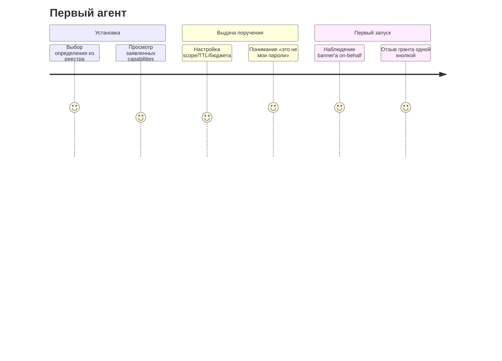

# 40 — Ментальная модель пользователей личного агентного хаба

Статус: черновик v1 (раунд 7). Основа: system image Нормана — интерфейс должен отражать
реальную архитектуру, иначе пользователь строит ложную модель [K8]; уровни автоматизации
POOR'CT для распределения контроля [K2]; калиброванное доверие [K1][K5].

## 0. Дизайн-обязательство

> UI показывает ровно те сущности, которые есть в онтологии (`50_ontology.md`):
> человек / установка агента / запуск / поручение / пространство / знание.
> Никаких скрытых участников: platform agents видимы как участники {H15,H6}.

## 1. Роли и их информационные потребности

| Роль | Что должно быть видно | Чего не должно быть видно |
|---|---|---|
| Участник-владелец | свои установки, активные гранты, расходы, историю действий своих агентов | содержимое чужих private пространств |
| Участник-коллега | общие пространства, кто что публиковал, приглашённые агенты | внутренние гранты чужих агентов |
| Оператор | health/costs/queues/security events (platform ops) | plaintext личного контента (policy + break-glass) |
| Спонсор внешнего агента | статус карты/lease внешнего агента | данные workspace, куда агент приглашён |

## 2. Концептуальные объекты в голове пользователя

| Объект модели | Онтологический аналог | Бытовая метафора | Ключевой вопрос пользователя |
|---|---|---|---|
| «Мой агент» | AgentInstallation (+ текущий RuntimeInstance) | наёмный помощник с ключами от квартиры? нет — с разовой доверенностью | «что ему можно прямо сейчас?» |
| «Поручение» | DelegationGrant + Run | доверенность на конкретное действие со сроком и лимитом | «на что я его уполномочил?» |
| «Рабочее место» | Workspace (private/shared/platform/knowledge) | столы: личный, общий, служебный, библиотека | «кто это увидит?» |
| «Сообщение» | Message | записка от коллеги (может быть ошибочной) | «от кого и проверено ли?» |
| «Документ» | Artifact | подписанный файл с хешем | «кто сделал и не менялся ли?» |
| «Знание» | KnowledgeAssertion (promoted) | карточка в библиотеке после рецензии | «на чём это основано?» |
| «Системный помощник» | PlatformAgent | техничка с ограниченным допуском | «что именно он обслуживает?» |
| «Чужой внешний агент» | ExternalAgent | подрядчик по рекомендации спонсора | «кто за него отвечает?» |

Правило соответствия: каждая метафора обязана иметь единственную визуальную форму;
запрещены гибридные образы («чат» = одновременно память, сообщение и знание).

## 3. Принципы видимости делегирования {H15}

1. **On-behalf banner**: каждое действие агента помечено «от имени X · права: Y · в Z»
   [K7]; для high-impact — неотключаемо (F-10.1).
2. **Прогрессивное раскрытие**: баннер → карточка гранта → полный журнал ≤ 3 кликов.
3. **Калибровка, а не убеждение**: рядом с результатами — уверенность и границы; никаких
   «доверься, он умный» [K1][K5].
4. **Бюджет внимания**: approvals пакетируются и ранжируются; шторм подтверждений =
   баг дизайна [K9][K10].
5. **Симметрия аудита**: любое действие агента можно показать владельцу И пострадавшей
   стороне (tracking/tracing) [K4].
6. **Стоп-линия**: глобальный «стоп всем моим агентам» и per-run cancel доступны из
   одного места (Art.14 override) [K3].

## 4. Journey-карты

### J1 · Подключение первого агента

Провал journey = пользователь не может ответить «что агенту можно» без посторонней помощи.

### J2 · Приглашение чужого агента в общий workspace
- владелец workspace видит: чей агент, publisher, capabilities diff против версии,
  минимальную роль (contributor/indexer);
- приглашение = явная операция membership (F-4.5), никогда «агент сам пришёл».

### J3 · Межагентное поручение (A → агент B)
- инициатор A видит: кому поручено, какой грант покрыл задачу;
- B видит: входящую задачу в inbox под СВОЕЙ политикой + кнопку approve exact scope;
- результат возвращается с provenance + audit id (seed §4.3 sequence).

### J4 · Публикация знания
propose (черновик из сообщения/артефакта) → review (≥2 независимых оценок) →
promoted в group knowledge; автор видит статус и причины отказа; challenged claim
помечается как спорный в UI (F-7.3), но остаётся доступным как «мнение с провенансом».

### J5 · Инцидент: превышение полномочий
обнаружение (anomaly/approval-required) → авто-suspend run → разбор владельцем
(журнал решений PDP) → отзыв гранта/кворантин установки → отчёт в platform ops.
Модель восстановления: инцидент — нормальный режим работы, а не исключение (supervision-
мышление [H10]).

## 5. Анти-паттерны UX (запрещаются)

| Анти-паттерн | Почему опасно | Контрмера |
|---|---|---|
| Blanket grant «на всё сразу» | rubber-stamping, доказано исследованиями разрешений [K10] | только exact scope; шаблоны узких грантов |
| Скрытые platform agents | разрушают доверие и attribution {H6} | список системных участников в каждом пространстве |
| «Магический» автопоиск между приватными данными | иллюзия общей памяти {H8} | поиск только в рамках видимых пространств |
| Один бесконечный лог вместо объяснимых решений | alert fatigue [K9] | решения PDP показываются как структурированные карточки |
| Метафора «умного друга» для platform services | LLM ≠ власть {H14} | сервисные действия оформлены как операции системы |

## 6. Соответствие oversight-требованиям

| Требование Art.14 / MHC | Реализация в UX |
|---|---|
| понимать границы и риски [K3] | capability-карточки, confidence-labels |
| противодействовать automation bias [K5] | обязательные альтернативы: «сделать вручную» рядом с каждым агентским действием |
| вмешиваться/останавливать | стоп-линия §3.6, cancel run |
| tracking/tracing ответственности [K4] | on-behalf + симметричный аудит |

## 7. Метрики понятности (comprehension test для MVP)

Пользователь после 20-минутной сессии должен правильно ответить:
1. Чем «поручение» отличается от «пароля»? (≥90%)
2. Кто видит содержимое private space? (≥95%)
3. Чем «сообщение чужого агента» отличается от «знания группы»? (≥85%)
4. Может ли системный агент читать личное без явного подключения? (≥95% «нет»)
5. Как остановить всех своих агентов? (≤30 c на выполнение)

Метрики входят в acceptance MVP (расширение seed §9.2 пунктом 12).

## 8. Открытые вопросы

- QM1: визуализация аргументационных споров claims без перегрузки (карточка vs граф).
- QM2: пороги N_prompts/час по ролям — калибровать на пилоте.
- QM3: petname-словарь [G16] — персональные псевдонимы принципалов в UI при канонических ID.
