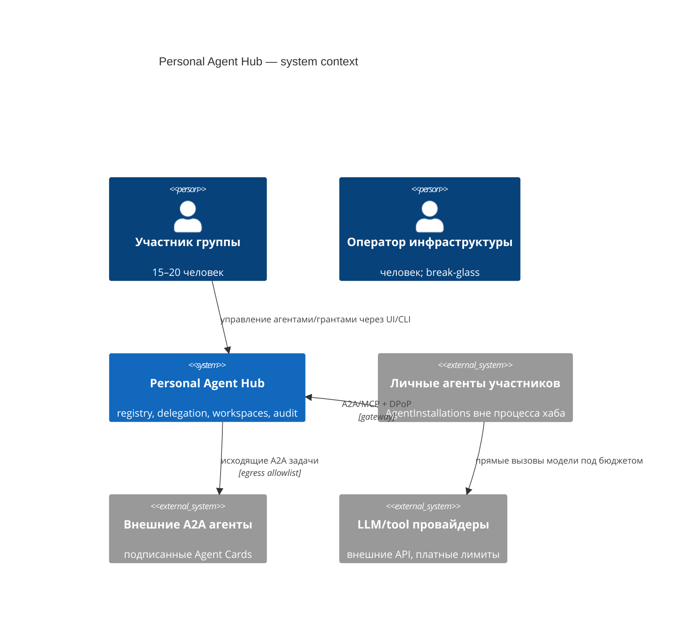
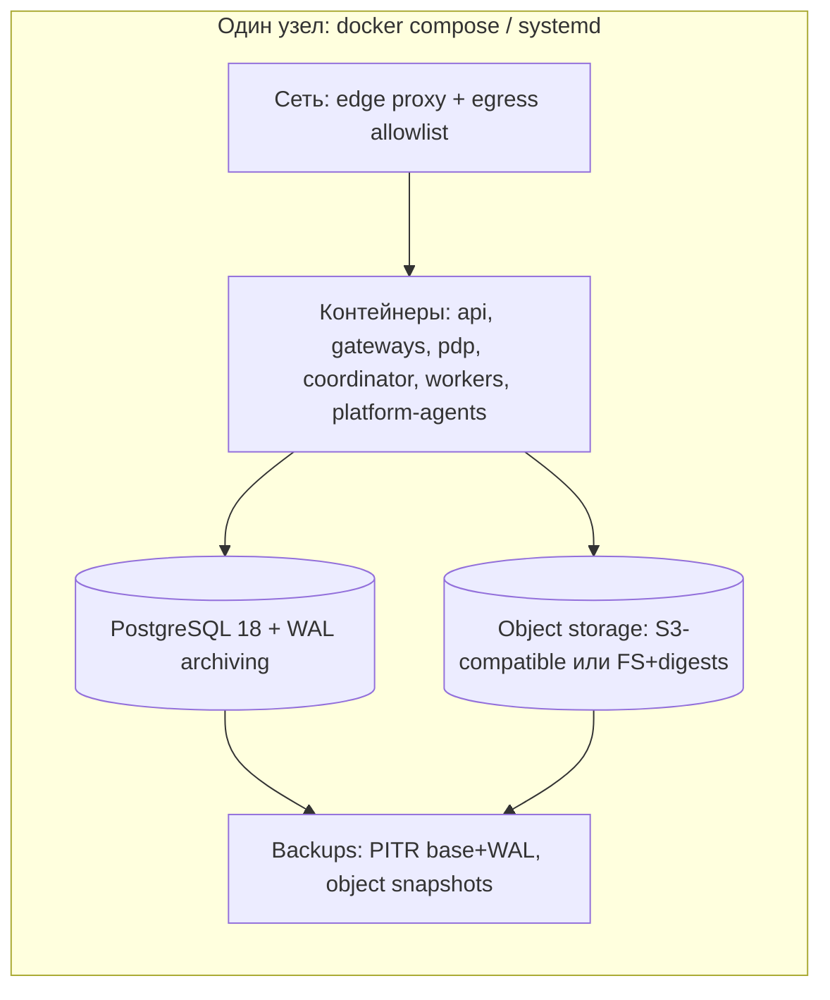

# 30 — Архитектурные модели личного агентного хаба

Статус: v2, независимо проаудирован (раунд 13). Уровни: контекст → контейнеры → компоненты → данные →
runtime → интерфейсы → топологии/развёртывание. Трассировка: `{H…}` гипотезы,
`F-x.y` фичи (`20_feature_catalog.md`), `[ID…]` источники.

## 1. Контекстная модель



Границы доверия: (1) хаб ↔ личные агенты (взаимная аутентификация, DPoP [B6]);
(2) хаб ↔ внешние агенты (спонсор + подписанные карты [A1]); (3) оператор — инфраструктура,
но не прикладной доступ {H14}.

## 2. Контейнерная модель A+

```mermaid
flowchart LR
    subgraph Edge[Edge / trust boundary]
        UI[Workspace UI/CLI] --> API[Control-plane API]
        GW[A2A Gateway] 
        TG[MCP Tool Gateway]
    end
    subgraph Core[Ядро решений - детерминированное]
        IDP[OIDC IdP + workload identity]
        PDP[PDP: ReBAC+ABAC+capability]
        REG[Registry svc]
        RUN[Run Coordinator]
        QTA[Quota Enforcer]
        KG[Knowledge Gate svc]
        AUD[Audit Writer + Outbox relay]
    end
    subgraph Agents[Platform agents - отдельные principals]
        IDX[Scoped Indexer]
        EVA[Evaluation]
        OPS[Ops Triage]
        CUR[Knowledge Curator]
        CON[Concierge]
    end
    subgraph Data[(Data plane)]
        PG[(PostgreSQL + RLS)]
        OBJ[(Immutable object store)]
        PROJ[(Search/vector projections per scope)]
    end
    API --> PDP
    GW --> PDP
    TG --> PDP
    PDP --> RUN
    RUN --> QTA
    RUN --> AUD
    KG --> AUD
    AUD --> PG
    REG --> PG
    IDX --> PROJ
    EVA --> KG
    CUR --> KG
    OPS --> AUD
    KG --> OBJ
    API --> PG
```

Правило зависимостей: всё, что принимает решения о власти, — синхронно через PDP;
всё, что фиксирует факт, — асинхронно через outbox [H4]; platform agents никогда не в
контуре решений {H14}, только в контурах предложений (proposal) [seed:§4.6].

## 3. Компонентные контракты (ключевые)

### 3.1 PDP

```text
in:  {actor_instance, subject, action, resource, purpose_run, ctx}
out: {decision: allow|deny|approval_required, decision_id, policy_version, ttl_cache}
SLO-target (не измерен): p95 < 20 ms локально; revoke-class кэш TTL = 0
deps: IdP (introspection), registry (quarantine), grants DB, membership graph
```
Соответствует матмодели §2 (порядок 1–8); отказ любой зависимости = deny (fail-closed).

### 3.2 Run Coordinator

```text
states: created → authorized → running ⇄ suspended → completed|cancelled|failed
lease: instance держит lease ≤ T_lease; продление требует живого гранта
safety: каждый retriable side-effect объявляет idempotency ИЛИ compensation [H5]
fan-out: F_max ≤ 10, depth ≤ 3 на старте [E16]; budget token-bucket per run [J3]
crash: восстановление replay'ем event history [H8][H9]; relay at-least-once;
consumer фиксирует effect_receipt атомарно с локальным эффектом, unknown outcome → reconciliation [H6]
```

### 3.3 Knowledge Gate pipeline

```text
proposed(из Message/Artifact) → сбор Evidence → canonical dedup/publisher correlation
→ Evaluation(n_independent ≥ 2, гетерогенно)
→ SHACL-валидация → promotion (Beta-порог, матмодель §5) | rejection
challenged → переоценка → promoted | retracted (TMS-зависимые уходят в under_review) [F16]
```

`canonical_source_id`, `publisher_id` и `independence_group` назначает доверенный
Provenance Resolver по versioned registry rules, а не агент/оценщик. Назначение immutable;
evaluation выполняется отдельным principal, а promotion-транзакция считает
`COUNT(DISTINCT independence_group)` после canonical dedup.

### 3.4 Audit Writer + Outbox relay

```text
атомарная запись: state-change + event в одной транзакции PG [H4]
envelope: CloudEvents-совместимый {id=decision_id, source, type, actor, subject,
delegation_id, workspace, run_id, policy_version, payload_digest}
append-only Merkle tree + подписанные tree heads (RFC 6962-стиль [I15]);
relay публикует подписчикам at-least-once
```

## 4. Модель данных (канонические таблицы, эскиз)

```sql
-- принципалы и владение (INV1: разные таблицы = разные identity)
users(id PK, oidc_sub UNIQUE, display_name, status);
definitions(digest PK, publisher_id, manifest JSONB, signature, declared_caps JSONB);
installations(id PK, definition_digest FK, owner_id FK NULL, workspace_id FK NULL,
              config JSONB, status CHECK (status IN ('draft','active','quarantined','revoked')));
runtime_instances(id PK, installation_id FK, lease_expires_at, identity_key_ref);
grants(id PK jti, subject_kind CHECK (subject_kind IN ('user','shared_workspace','platform_ops')),
       subject_ref NOT NULL, actor_installation FK,
       actions TEXT[], resources TEXT[], constraints JSONB, expires_at,
       budget_allocated CHECK (budget_allocated >= 0),
       budget_remaining CHECK (budget_remaining >= 0 AND budget_remaining <= budget_allocated),
       parent_grant FK NULL, depth SMALLINT CHECK (depth <= :kappa_grant),
       status CHECK (status IN ('proposed','active','revoked','expired','exhausted','denied')));
grant_budget_reservations(parent_grant FK, child_grant FK UNIQUE,
       amount CHECK (amount >= 0), status, PRIMARY KEY(parent_grant, child_grant));
workspaces(id PK, kind CHECK (kind IN ('private','shared','platform_ops','group_knowledge')));
memberships(principal_kind, principal_id, workspace_id FK, role, PRIMARY KEY(...));
objects(id PK, kind CHECK (kind IN ('message','artifact','memory_record','knowledge_assertion')),
        workspace_id FK NOT NULL, digest, payload_ref, trust_label, created_by, ttl);
evidence(id PK, object_id FK, kind, locator, digest,
         canonical_source_id NOT NULL, publisher_id NOT NULL,
         independence_group NOT NULL, resolver_version NOT NULL,
         metadata_frozen_at NOT NULL);
assertions(id PK FK objects, claim JSONB, status CHECK (...), promoted_by_activity UUID);
prov_activities(id PK, type, agent_ref, used_evidence UUID[], generated UUID[], occurred_at);
audit_events(seq PK, ts, decision_id, envelope JSONB, leaf_hash);       -- append-only
merkle_nodes(tree_size, level, node_index, hash, PRIMARY KEY(...));
signed_tree_heads(tree_size PK, root_hash, signed_at, signature);
outbox(seq PK, envelope JSONB, published_at NULL);                      -- at-least-once relay [H4]
effect_receipts(decision_id PK, effect_kind, outcome, payload_digest, committed_at);
reconciliation_cases(decision_id PK, state, observed_at, resolution);
quotas(subject_ref, bucket_r, bucket_b, tokens, updated_at);
```

Для `subject_kind='shared_workspace'` deferred constraint/trigger подтверждает
`workspaces.kind='shared'`; private/platform_ops/group_knowledge workspace не может
подменить grant subject. `platform_ops` ссылается на отдельный PlatformOpsSubject.
Evidence provenance-поля writable только ролью Provenance Resolver и после freeze
неизменяемы.

RLS-политики: каждая таблица с `workspace_id`/owner фильтруется по `current_setting('hub.subject')`;
application-role не является владельцем таблиц, BYPASSRLS запрещён [C14]{H2}. Object store:
ключи `obj/{workspace_id}/{digest}` — путь изолирован по scope; projections строятся per-scope
и проверяются тем же adversarial-набором, что и SQL (§9.2.1 базового документа).

## 5. Интерфейсные контракты (эскизы)

Control-plane API (фрагмент):

```text
POST /grants                 -> выдать грант (owner authn; exact scope; derive блокирует
                                parent row и атомарно резервирует child budget)
DELETE /grants/{jti}         -> revoke (≤5 c эффект)
POST /runs                   -> создать run (требует grant coverage)
GET  /runs/{id}/events       -> лента событий run (scope-filtered)
POST /workspaces/{id}/objects          -> положить Message/Artifact
POST /assertions/{id}/promote          -> запуск PromotionActivity (роль curator/editor)
POST /assertions/{id}/challenge        -> attack в аргументационный граф
GET  /export?subject={user|workspace}  -> переносимый JSON-LD пакет [F-8.3]
```

Gateway envelope (канонический конверт поверх A2A/MCP, адаптеры — свопабельные [A11]):

```json
{
  "ver": "1",
  "msg_type": "a2a_task_offer",
  "actor_instance": "inst:01J...",
  "subject": "user:daniil",
  "delegation_id": "dlg-789",
  "workspace": "ws:group-research",
  "run_id": "run-123",
  "purpose": "task:translate-report",
  "constraints": {"max_fanout": 5, "budget_tokens": 20000, "network": "allowlist"},
  "payload_digest": "sha256:...",
  "policy_version": "pv-2026-08-23"
}
```

## 6. Топологии: диффы относительно A+

| Аспект | A+ (baseline) | B: personal nodes | C: E2EE fabric |
|---|---|---|---|
| Хранение private данных | центральное PG+OBJ | personal vault у участника; CRDT sync опубликованного [G14][G15] | шифрованные комнаты; сервер = ciphertext |
| Индексация/поиск | server-side scoped projections | только опубликованное + локальные индексы | клиентские индексы участников |
| Platform agents | полные (scoped principals) | видят только опубликованное | ограничены room-membership; опция TEE [G7–G12] |
| Делегирование | hub PDP | распределённая: VC/petnames между узлами [B14][G16] | MLS-группы + capability внутри комнат [G3] |
| Отказ центра | недоступность всего | личные агенты живут offline | доставка при подключении |
| Триггер перехода | — | §9.3 условия базового документа | приоритет приватности коммуникаций |

Миграция A+→B аддитивна благодаря: workspace-scoped IDs, event sourcing [H3], portable
export (F-8.3), external gateway (F-11.5) — подтверждает вывод seed §10.2 «migration-ready,
но не оплачивать заранее».

## 7. Развёртывание (baseline A+)



Секреты: только из env/secret-store; runtime credentials выдаются коротко живыми (F-1.3);
ключи DPoP/mTLS агентов — на стороне установок [B6][B7]. Целевые, пока не измеренные
recovery criteria seed §5.3: process crash < 60 c (supervision + PITR),
0 потерянных committed audit events (outbox).

## 8. Трассировка

| Компонент/модель | Фичи | Гипотезы |
|---|---|---|
| PDP | F-3.1–3.4, F-4.5, F-9.1 | H4,H5,H13,H14 |
| Run Coordinator | F-5.2–5.4, F-11.2 | H7,H8 |
| Registry | F-2.1–2.5, F-1.4 | H3 |
| Knowledge Gate | F-7.1–7.6 | H16 |
| Audit/Outbox | F-8.1–8.5 | H14,H15 |
| Data plane + RLS | F-4.1, F-4.4, F-11.1 | H2,H10 |
| Топологии B/C | F-12.1–12.4 | H12 |

## 9. Открытые вопросы архитектуры

- QA1: единый process vs несколько контейнеров в MVP (рекомендация: модульный монолит с
  жёсткими внутренними контрактами §3 — упрощает deterministic simulation [H17]).
- QA2: выбор execution backend для Coordinator (простой in-process scheduler против
  durable-execution движка) — решить после F-11.4 benchmark.
- QA3: формат проекций поиска (per-scope index vs shared index с row-level фильтром на
  уровне retrieval) — влияет на adversarial-тесты §9.2.1.
