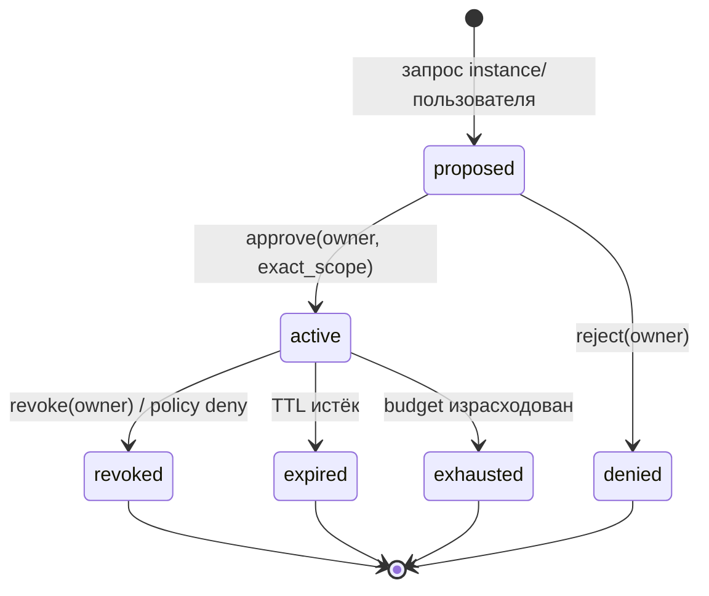
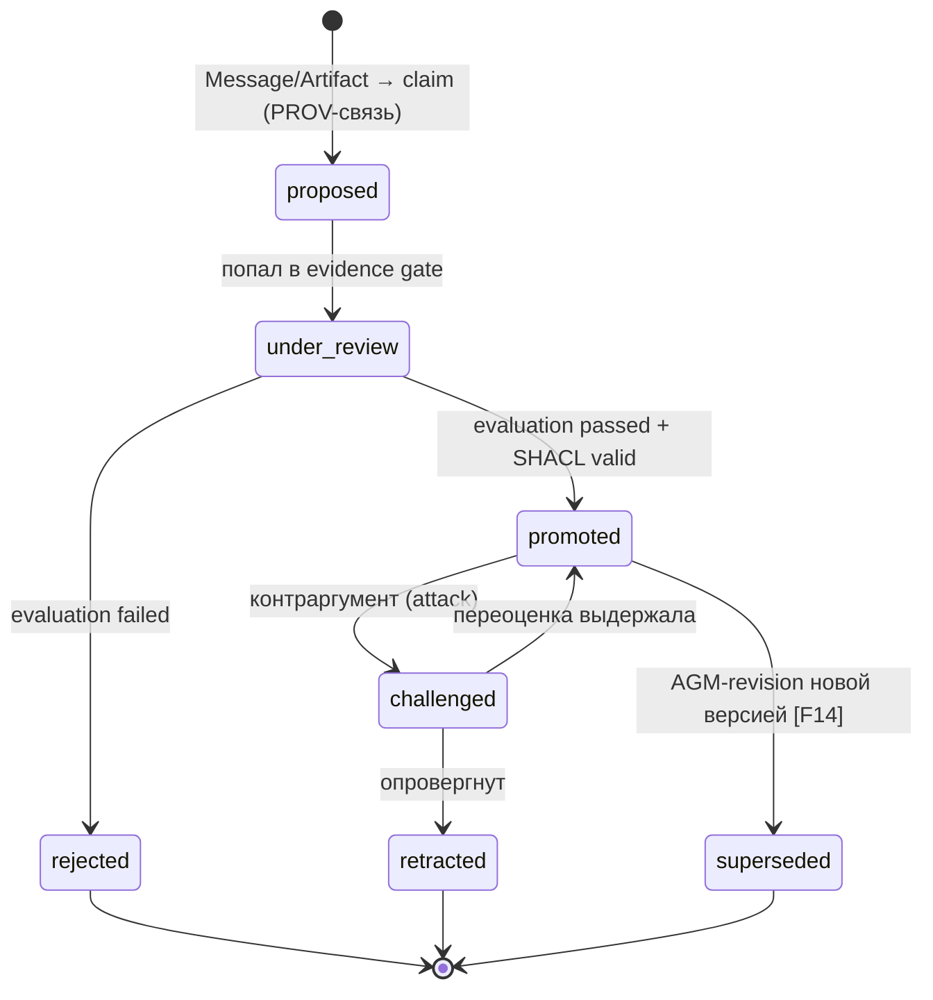

# 50 — Онтологическая модель личного агентного хаба

Статус: v2, независимо проаудирован (раунд 13). Источники: `research/sources/*.md`, базовый документ.
Формат ссылок: `[F8]` → строка мастер-реестра `10_source_registry.md`; объекты базового
документа цитируются как `[seed:§…]` (разделы) или каноническими ID серии Z (`[Z8]`);
S-нумерация отменена (см. реестр, раунд 8).

## 0. Принципы построения онтологии

1. **Переиспользуем W3C-стек, а не изобретаем**: RDF/RDFS для типизации [F1][F2], профиль
   OWL 2 RL/EL для tractable-рассуждений [F3], JSON-LD 1.1 как wire-формат [F5], SKOS для
   выравнивания пользовательских словарей [F6], SHACL для структурных гейтов [F4],
   PROV-O для провенанса [F7][F8].
2. **Онтология ≠ enforcement**: обязательные поля дублируются SQL-констрейнтами и валидаторами
   приложения; SHACL — переносимый контракт, не единственный слой проверки [seed:§7.1].
3. **Онтология фиксирует то, что протоколы не выражают**: A2A/MCP не знают owner, private
   workspace, delegation, budget, promotion [A1][A4][seed:§4.3] — это и есть ядро хаба.
4. **Социальные объекты — первоклассные**: роли [D9][D17], направленные обязательства
   (commitments) [D18], нормы поверх разрешений [D19][L1][L4].
5. **Знание отделено от сообщения**: Message ≠ Artifact ≠ MemoryRecord ≠ KnowledgeAssertion
   [seed:H8/H16]; продвижение — отдельная деятельность (Activity) с доказательствами.

## 1. Верхние классы (TBox)

```mermaid
classDiagram
    class Principal {
      <<abstract>>
      +PrincipalId id
    }
    class HumanUser
    class PlatformOpsSubject
    class SoftwarePrincipal {
      <<abstract>>
      +keyMaterialRef
    }
    class AgentDefinition {
      +digest, version
      +declaredCapabilities
    }
    class AgentInstallation {
      +config, status
    }
    class AgentRuntimeInstance {
      +lease, startedAt
    }
    class PlatformAgent
    class PlatformService {
      +deterministic=true
    }
    class ExternalAgent {
      +sponsor
    }
    class DelegationGrant {
      +subject, actor, actions, resources
      +constraints, ttl, budget
    }
    class Workspace {
      <<abstract>>
    }
    class PrivateWorkspace
    class SharedWorkspace
    class PlatformOpsSpace
    class GroupKnowledgeSpace
    class ContentObject {
      <<abstract>>
      +workspaceScope, digest
    }
    class Message
    class Artifact
    class MemoryRecord
    class KnowledgeAssertion
    class Evidence
    class Evaluation
    class PromotionActivity
    class Commitment {
      +debtor, creditor, deadline
    }
    class Role
    class AuditEvent
    class QuotaLedger
    class Run {
      +state
    }
    class PolicyObject {
      +normExpr
    }

    Principal <|-- HumanUser
    Principal <|-- PlatformOpsSubject
    Principal <|-- SoftwarePrincipal
    SoftwarePrincipal <|-- AgentInstallation
    SoftwarePrincipal <|-- AgentRuntimeInstance
    SoftwarePrincipal <|-- PlatformAgent
    SoftwarePrincipal <|-- PlatformService
    SoftwarePrincipal <|-- ExternalAgent
    AgentDefinition "1" o-- "0..*" AgentInstallation : installed_as
    AgentInstallation "1" --> "0..*" AgentRuntimeInstance : instantiated_by
    DelegationGrant "0..*" --> "0..1" HumanUser : subject_user
    DelegationGrant "0..*" --> "0..1" SharedWorkspace : subject_workspace
    DelegationGrant "0..*" --> "0..1" PlatformOpsSubject : subject_platform_ops
    DelegationGrant "0..*" --> "1" AgentInstallation : actor_installation
    Workspace <|-- PrivateWorkspace
    Workspace <|-- SharedWorkspace
    Workspace <|-- PlatformOpsSpace
    Workspace <|-- GroupKnowledgeSpace
    ContentObject <|-- Message
    ContentObject <|-- Artifact
    ContentObject <|-- MemoryRecord
    ContentObject <|-- KnowledgeAssertion
    KnowledgeAssertion --> Evidence : supported_by
    PromotionActivity --> KnowledgeAssertion : generates
    PromotionActivity --> Evidence : uses
```



### 1.1. Классы принципалов (выравнивание с identity-стеком)

| Класс | Должен иметь | Обоснование |
|---|---|---|
| `HumanUser` | OIDC-субъект [B3], человек принимает решения и выдаёт delegation | [seed:§2.1] |
| `AgentDefinition` | content-addressed digest (OCI-артефакт) [seed:25], подпись publisher (JWS/Cosign) [A2][seed:29], декларацию capabilities | разделение «шаблон ≠ установка» [seed:H3] |
| `AgentInstallation` | отдельный principal-идентификатор; ссылку на definition-digest; собственные ключи | Entra Agent ID / per-agent IAM role как prior art [M5][M7] |
| `AgentRuntimeInstance` | короткоживущий workload-identity (SVID-подобный) [B19][B20], lease | SPIFFE/K8s bound tokens [B22] |
| `PlatformAgent` | service principal БЕЗ наследования admin; явное membership в workspace | [seed:H6], Zero Trust [C13] |
| `PlatformService` | детерминированный компонент (IAM/PDP/audit/registry/scheduler), не LLM | [seed:H14], Cedar-верифицируемость [C8][C9] |
| `ExternalAgent` | A2A Agent Card [A1], внешний publisher + локальный спонсор | registry-паттерн [A7][A13] |

Инвариант I1 (identity separation): `HumanUser ≠ AgentDefinition ≠ AgentInstallation ≠
AgentRuntimeInstance`; доверие не наследуется по цепочке инстанцирования [seed:H3][B29].

## 2. Ключевые отношения (RBox)

| Отношение | Домен → Диапазон | Семантика | Источник-аналог |
|---|---|---|---|
| `owns` | HumanUser → AgentInstallation \| Workspace | владение и право выдавать delegation | Zanzibar owner [C5] |
| `installed_as` | AgentDefinition → AgentInstallation | immutable-шаблон → живая установка | OCI digest [seed:25] |
| `instantiated_by` | AgentInstallation → AgentRuntimeInstance | запуск под lease | SPIFFE SVID [B20] |
| `acts_for` | AgentRuntimeInstance → HumanUser \| SharedWorkspace \| PlatformOpsSubject | действует от имени (subject) через grant | RFC 8693 actor [B4]; prov:actedOnBehalfOf [F8] |
| `delegated_via` | AgentRuntimeInstance → DelegationGrant | конкретное ограничение полномочий | macaroon caveats [B17]; biscuit [B18] |
| `member_of` | HumanUser \| SoftwarePrincipal → Workspace, роль | членство с ролью | ReBAC tuple [C5]; MOISE+ role [D9] |
| `service_of` | PlatformAgent/Service → Platform | системная принадлежность, не власть | [seed:H6] |
| `located_in` | ContentObject → Workspace (ровно один) | scope каждой записи | CArtAgO artifact-in-workspace [D8] |
| `derived_from` | MemoryRecord \| Artifact → ContentObject | происхождение, не право чтения | PROV derivation [F7] |
| `supported_by` | KnowledgeAssertion → Evidence | claim трассируется к доказательствам | Chain-of-Evidence [Z8]; Carneades [F20] |
| `generated_by` | ContentObject → PromotionActivity \| Run | кто произвёл | PROV wasGeneratedBy [F8] |
| `attests` | Evaluation → KnowledgeAssertion | вердикт оценщика | ASPIC+ attack/support [F19] |
| `commits_to` | SoftwarePrincipal → Commitment (debtor→creditor) | публично проверяемое обязательство | Singh commitments [D18] |
| `constrains` | PolicyObject \| QuotaLedger → Principal \| Action | нормы поверх разрешений | I/O logics [L4]; norms [D19] |

Инвариант I2 (monotonic attenuation): производный DelegationGrant может только сужать
действия/ресурсы/бюджет родительского; расширение запрещено [B17][B26][B29].

Инвариант I3 (single scope): каждый ContentObject находится ровно в одном Workspace;
копирование в другое пространство = новая операция publish (новый объект + PROV-связь).

Инвариант I4 (single subject, installation-bound actor): DelegationGrant имеет ровно один
subject (HumanUser XOR SharedWorkspace XOR PlatformOpsSubject) и одного актора —
AgentInstallation; конкретный AgentRuntimeInstance привязывается в authorize() проверкой
`inst(a) = ι_a` и health-статусом установки.

Инвариант I5 (delegation budget conservation): создание производного гранта атомарно
резервирует его бюджет в ledger родителя; сумма spent + outstanding child reservations не
может превышать budget_allocated родителя, в том числе при конкурентных derive().

## 3. Жизненные циклы (state machines)

### 3.1. DelegationGrant



- `active` выдаётся только на exact action/resource/constraint set [B5]; отзыв обязателен
  ≤5 c на новые действия [seed:§9.2.4]; introspection-паттерн [B13].

### 3.2. KnowledgeAssertion (promotion gate)



- Сообщение пир-агента может создать только `proposed`, никогда `promoted` [seed:H16].
- `retracted` использует dependency-directed retraction (TMS) для зависимых записей [F16].
- Спор разрешается аргументационной семантикой (grounded/preferred extensions) [F18][F19]
  с burden-of-proof профилем по типу claim [F20].

### 3.3. AgentInstallation

`draft → active ⇄ quarantined; active → revoked; quarantined → revoked`; quarantine
обязателен при capability-diff новой
версии definition (supply-chain контроль) [seed:§8][I9].

### 3.4. Run

`created → authorized → running ⇄ suspended → completed | cancelled | failed`;
переход `authorized` атомарен с записью audit-event (transactional outbox) [seed:H10].

## 4. Выравнивание с внешними стандартами

| Хаб-объект | A2A [A1] | MCP [A4] | PROV-O [F8] | Прочее |
|---|---|---|---|---|
| AgentDefinition | Agent Card; подпись — требование хаба (ядро A2A её не гарантирует) [A2] | — | — | OCI + Cosign [seed:25][seed:29] |
| AgentRuntimeInstance | A2A endpoint/agent | MCP client/server | prov:Agent | SPIFFE SVID [B19] |
| Задача/Run | Task lifecycle | `io.modelcontextprotocol/tasks` extension (rev 2026-07-28) [A6] | prov:Activity | — |
| Artifact | Artifact (immutable) | Resource* | prov:Entity | content-addressed; immutability — политика хаба поверх MCP Resource (тот по определению изменяем, для того subscriptions) |
| Message | Message | — | — | FIPA-перформатив [D5][D6] |
| DelegationGrant | — (не выражает!) | OAuth 2.1 resource server [A5] | actedOnBehalfOf | RFC 8693+9396+9449 [B4][B5][B6] |
| KnowledgeAssertion | — | — | prov:Entity + derivation | SKOS-концепт для тем [F6] |

Правило: протокольные идентификаторы (task id, card URL) хранятся как `externalRef`, но не
заменяют канонические хаб-ID (I1).

## 5. SHACL-эскизы (структурные гейты)

```turtle
hubs:KnowledgeAssertionShape a sh:NodeShape ;
  sh:targetClass hubs:KnowledgeAssertion ;
  sh:property [
    sh:path hubs:supportedBy ;
    sh:class hubs:Evidence ; sh:severity sh:Violation ] ;
  sh:property [
    sh:path hubs:status ; sh:minCount 1 ; sh:maxCount 1 ;
    sh:datatype xsd:string ;
    sh:in ( "proposed" "under_review" "promoted" "challenged" "retracted" "superseded" "rejected" ) ] ;
  sh:property [
    sh:path hubs:locatedIn ; sh:minCount 1 ; sh:maxCount 1 ;
    sh:class hubs:Workspace ] ;
  sh:or (
    [ sh:not [ sh:property [ sh:path hubs:status ; sh:hasValue "promoted" ] ] ]
    [ sh:property [
        sh:path prov:wasGeneratedBy ; sh:minCount 1 ; sh:maxCount 1 ;
        sh:class hubs:PromotionActivity ; sh:severity sh:Violation ] ;
      sh:property [
        sh:path hubs:supportedBy ; sh:minCount 1 ;
        sh:class hubs:Evidence ; sh:severity sh:Violation ] ]
  ) .

hubs:DelegationGrantShape a sh:NodeShape ;
  sh:targetClass hubs:DelegationGrant ;
  sh:property [
    sh:path hubs:subject ; sh:minCount 1 ; sh:maxCount 1 ;
    sh:or ( [ sh:class hubs:HumanUser ]
            [ sh:class hubs:SharedWorkspace ]
            [ sh:class hubs:PlatformOpsSubject ] ) ] ;
  sh:property [
    sh:path hubs:actor ; sh:minCount 1 ; sh:maxCount 1 ;
    sh:class hubs:AgentInstallation ] ;
  sh:property [ sh:path hubs:actions ; sh:minCount 1 ] ;
  sh:property [ sh:path hubs:resources ; sh:minCount 1 ] ;
  sh:property [ sh:path hubs:constraints ; sh:maxCount 1 ] ;
  sh:property [ sh:path hubs:jti ; sh:minCount 1 ; sh:maxCount 1 ;
    sh:datatype xsd:string ] ;
  sh:property [ sh:path hubs:ttl ; sh:minCount 1 ; sh:maxCount 1 ;
    sh:datatype xsd:dayTimeDuration ;
    sh:maxInclusive "PT15M"^^xsd:dayTimeDuration ] ;  # политика по умолчанию
  sh:property [
    sh:path hubs:budget ; sh:minCount 1 ; sh:maxCount 1 ;
    sh:datatype xsd:decimal ; sh:minInclusive 0 ] ;
  sh:property [
    sh:path hubs:status ; sh:minCount 1 ; sh:maxCount 1 ;
    sh:datatype xsd:string ;
    sh:in ( "proposed" "active" "revoked" "expired" "exhausted" "denied" ) ] .

hubs:EvidenceShape a sh:NodeShape ;
  sh:targetClass hubs:Evidence ;
  sh:property [
    sh:path hubs:canonicalSourceId ; sh:minCount 1 ; sh:maxCount 1 ;
    sh:datatype xsd:string ] ;
  sh:property [
    sh:path hubs:publisherId ; sh:minCount 1 ; sh:maxCount 1 ;
    sh:datatype xsd:string ] ;
  sh:property [
    sh:path hubs:independenceGroup ; sh:minCount 1 ; sh:maxCount 1 ;
    sh:datatype xsd:string ] ;
  sh:property [
    sh:path hubs:resolverVersion ; sh:minCount 1 ; sh:maxCount 1 ;
    sh:datatype xsd:string ] ;
  sh:property [
    sh:path hubs:metadataFrozenAt ; sh:minCount 1 ; sh:maxCount 1 ;
    sh:datatype xsd:dateTime ] .
```

Формы намеренно не `sh:closed`: у экземпляров допустимы `rdf:type`, PROV и наследуемые
ContentObject-свойства. Evidence/PromotionActivity обязательны условно только для
`promoted`; `proposed` может существовать до evidence gate.
Evidence provenance-поля назначаются только доверенным Provenance Resolver, versioned и
immutable после `metadataFrozenAt`; ingesting agent/evaluator не являются authority.

Именование: отношения RBox (§2) даны в snake_case для читаемости; канонические RDF-свойства —
camelCase (supported_by ↦ hubs:supportedBy, located_in ↦ hubs:locatedIn, acts_for ↦ hubs:actsFor,
delegated_via ↦ hubs:delegatedVia, …). Дублирование: те же поля — NOT NULL/CK в PostgreSQL;
валидатор приложения на границе API [seed:§7.1].

## 6. Нормативный слой (governance поверх разрешений)

- `Role`-схемы per workspace — канонический список viewer/editor/contributor/indexer/curator
  (concierge — префикс платформенных сервисов, не роль workspace; единый список ведёт
  20_feature_catalog.md F-4.5) — по MOISE+/Aalaadin
  [D9][D17]. Чтобы ограничить role-explosion, дизайн хаба привязывает роли к workspace-типам,
  а не к парам «пользователь×ресурс»; это инженерный вывод из RBAC0–3 [C1], не claim статьи.
- `Commitment` (debtor, creditor, goal, deadline, discharge/cancel условия) — публично проверяемый
  социальный объект для межагентных обещаний [D18]; shared mental attitudes командной работы
  дают дополнительную мотивацию [D12], но конкретные notification obligations задаёт хаб;
  нарушение commitment → machine-checkable
  violation-факт, попадающий в evidence gate (не в авторизацию напрямую).
- Нормы (что допустимо в каком workspace-типе) выражаются как input→output правила, устойчивые к
  contrary-to-duty случаям [L3][L4]; LLM может предлагать норму, но не утверждать её [seed:H14].

## 7. Эпистемическая семантика (что «знает» установка)

- Состояние знания установки = множество MemoryRecord + KnowledgeAssertion, доступных её scope;
  формально Kripke-модель по FHMV [F11], обновление сообщениями — action models DEL [F12][F13].
- Практическое следствие: «shared knowledge группы» — это общее знание только в
  GroupKnowledgeSpace и только из promoted assertions; всё остальное — belief с trust-label.
- Различение revision (исправление claim) vs update (смена состояния workspace) обязательно
  [F14][F15] — иначе ретракция ломает провенанс.

## 8. Анти-паттерны, которые онтология запрещает

1. Общая writable-память между пользователями (нет класса SharedMemory) [seed:H8].
2. Наследование полномочий definition→installation→instance (только явные grants) [B29].
3. Platform agent как «супер-пользователь» (только scoped membership) [seed:H6].
4. Продвижение знания как побочный эффект доставки сообщения [seed:H16].
5. Отрицательные разрешения в ядре политики (только positive grants + exception-канал) [C15][C8].
6. Слияние Message/Memory/Knowledge в один тип [seed:§4.4].

## 9. Открытые вопросы онтологии

- Q1: выражать ли Workspace как PROV-Dictionary для lineage вставок/удалений [F9] в MVP или
  ограничиться плоским scope-полем (рекомендация: плоское поле, словарь — при экспорте).
- Q2: нужны ли STIT/ATL-аннотации ответственности в audit (offline-анализ возможностей) [L5][L6]
  — отложено в аналитический слой, не в runtime.
- Q3: гранулярность Evidence (документ vs span vs digest) — трёхуровневая модель дополнена
  `canonical_source_id`, publisher provenance и independence group; калибровка весов остаётся
  частью benchmark/pilot.
