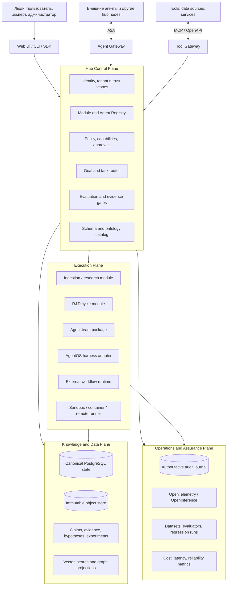

# Агентный хаб как самостоятельная платформа: аналоги, пробелы и greenfield-архитектура

**Статус:** исследовательский проект решения  
**Дата среза:** 23 августа 2026 года  
**Язык:** русский  
**Объект:** хаб для людей, машин, агентов и подключаемых модулей; существующий AgentOS harness рассматривается только как один возможный модуль

> Уточнение для закрытой группы из 15–20 пользователей, personal agents и platform agents вынесено в отдельную проверку гипотез: [personal_agent_hub_15_20_hypothesis_review_2026.md](personal_agent_hub_15_20_hypothesis_review_2026.md).

## Аннотация

Исследование проверяет, существует ли уже платформа, объединяющая людей, внешних агентов, машины, накопление проверяемого знания и автоматизированные исследовательские циклы. Сопоставлены enterprise-платформы, агентные фреймворки, durable-execution системы, протоколы взаимодействия, средства наблюдаемости, стандарты provenance и системы автоматизации исследований. На 23 августа 2026 года значительная часть концепта уже реализуется коммерческими платформами Palantir, OpenAI, Google и Microsoft: реестры агентов, единый контекст, управление доступом, исполнение, наблюдаемость и оценка. Однако не обнаружено подтверждённого готового решения, которое одновременно было бы открытым и федеративным, принимало произвольные agent/harness-модули как взаимозаменяемые пакеты, управляло доверием между организациями и поддерживало формальную эпистемическую цепочку «утверждение → свидетельство → гипотеза → эксперимент → результат → решение».

Рекомендуется не строить «суперагента». Целевая форма: федеративно-готовый модульный control plane с независимыми data, knowledge, execution, trust и observability planes. Первую физическую реализацию следует оставить модульным монолитом на PostgreSQL с объектным хранилищем и transactional outbox; A2A использовать для взаимодействия удалённых агентов, MCP только для инструментов и контекста. Онтология должна разделять операционные сущности, эпистемические утверждения, provenance и границы доверия. Текущий AgentOS harness подключается через тот же контракт, что и другие исполнители, и не определяет архитектуру хаба.

**Ключевые слова:** agent hub, multi-agent platform, knowledge provenance, R&D automation, ontology, A2A, MCP, durable execution

## 1. Решение в одном абзаце

Концепт стоит развивать, но позиционировать его как **open evidence-native agent hub**, а не как «первую операционную систему для агентов». Рынок уже подтверждает спрос на единые платформы агентов, но действующие предложения в основном замыкают пользователя в облаке поставщика и используют операционный business context, память или телеметрию вместо формализованного жизненного цикла знания. Предлагаемая отличительная способность: любой агент, набор агентов, workflow-движок или harness устанавливается как подписанный модуль с явными возможностями и ограничениями; результаты становятся общим знанием только после проверки происхождения, независимой оценки и прохождения policy/evidence gate.

## 2. Граница исследования

### 2.1. Что считается хабом

Хаб представляет собой постоянную платформу, которая:

1. связывает нескольких людей, tenant-организации, машины, локальных и удалённых агентов;
2. регистрирует и запускает взаимозаменяемые модули;
3. маршрутизирует цели, задачи, события, артефакты и контекст;
4. обеспечивает идентичность, полномочия, изоляцию, аудит и согласования;
5. хранит не только сообщения, но и формальные утверждения, доказательства, эксперименты, результаты и решения;
6. улучшает конфигурации по измеримым результатам, не позволяя агенту самостоятельно объявить себя успешным;
7. предоставляет человеко-ориентированный интерфейс и машиночитаемые API/протоколы.

### 2.2. Что не является ядром

Существующий репозиторий AgentOS реализует отдельный harness «идея → спецификация → исполнение → проверенный результат». В этой работе он **не используется как фундамент хаба**. В целевой схеме это один подключаемый `ExecutorModule`, равноправный с исследовательским агентом, ingestion-модулем, внешним SaaS-агентом или durable workflow runtime. Его внутренние инварианты могут быть повторно использованы как идеи на границах доверия, но не переносятся на платформу автоматически.

### 2.3. Исследовательский вопрос

> Какие части такого хаба уже существуют на 23 августа 2026 года, какой незакрытый архитектурный разрыв остаётся и какая конфигурация технологий, архитектурных моделей, ментальных моделей и формальной онтологии позволяет проверить концепт с минимальным преждевременным усложнением?

## 3. Метод и ограничения доказательств

Проведён целевой обзор официальных спецификаций, документации продуктов, первичных исследовательских публикаций и стандартов. В матрицу включены 20 классов решений и более 30 первичных или нормативных источников. Поиск не был систематическим обзором с экспортом всех поисковых записей, поэтому PRISMA-полнота и доказательство отсутствия любого неизвестного продукта не заявляются.

Источники взвешивались так:

- стандарты и спецификации устанавливают интерфейсы и обязательные свойства;
- официальная документация подтверждает заявленные функции, но не сравнительную эффективность;
- peer-reviewed исследования сильнее для эмпирических результатов;
- препринты и vendor research считаются предварительными или конфликтно-заинтересованными;
- архитектурные рекомендации ниже являются синтезом автора отчёта, а не прямым выводом одного источника.

## 4. Что уже существует

### 4.1. Сравнительная матрица

Обозначения: **✓** означает явную поддержку; **△** означает частичную поддержку или интеграцию; **нет** означает, что свойство не является задачей решения. Колонка «знание» означает не vector memory, а структурированные утверждения с provenance и статусом проверки.

| Решение / подход | Основной слой | Multi-user / agents | Durable execution | Федерация / open protocol | Формальная онтология знания | R&D evidence loop | Главный вывод |
|---|---|---:|---:|---:|---:|---:|---|
| [Palantir AIP + Foundry + Apollo](https://www.palantir.com/docs/foundry/architecture-center/aip-architecture) <!--ref:palantir-aip-2026--><!--anchor:section:The%20Ontology%20system--> | enterprise operating platform | ✓ | ✓ | △ | △, сильная operational ontology | △ | Ближайший целостный аналог; проприетарен, ontology ориентирована на операции и решения |
| [OpenAI Frontier](https://openai.com/business/frontier/) <!--ref:openai-frontier-2026--><!--anchor:section:Operate%20AI%20coworkers%20on%20a%20single%20enterprise%20platform--> | enterprise agent platform | ✓ | ✓ | △ | △, Business Context | △, eval/optimization | Очень близок по shared context, identity, execution и improvement; открытая эпистемическая модель не опубликована |
| [Google Gemini Enterprise Agent Platform](https://cloud.google.com/blog/products/ai-machine-learning/introducing-gemini-enterprise-agent-platform) <!--ref:google-agent-platform-2026--><!--anchor:section:Why%20Agent%20Platform%20matters%20for%20your%20business--> | agent control plane | ✓ | ✓ | ✓, A2A/MCP/ecosystem | △, Memory/enterprise data | △, simulation/evaluation | Registry, Identity, Gateway, Runtime и Evaluation подтверждают сам класс продукта |
| [Microsoft Foundry](https://learn.microsoft.com/en-us/azure/foundry/what-is-foundry) <!--ref:microsoft-foundry-2026--><!--anchor:section:Core%20capabilities--> | enterprise AI/agent platform | ✓ | ✓ | ✓, A2A/MCP/API | △ | △, evals/tracing | Сильный управляемый enterprise-слой; не является открытым knowledge/R&D OS |
| [LangGraph](https://langchain-ai.github.io/langgraph/index.html) <!--ref:langgraph-docs-2026--><!--anchor:section:Core%20benefits--> | low-level orchestration runtime | △ | ✓ | △ | нет | △ | Хороший runtime-адаптер, но не хаб, IAM, marketplace или knowledge authority |
| [Microsoft Agent Framework](https://learn.microsoft.com/en-us/agent-framework/overview/) <!--ref:ms-agent-framework-2026--><!--anchor:section:What%20is%20Microsoft%20Agent%20Framework--> | SDK + graph workflows | △ | ✓ | ✓ | нет | △ | Современный successor AutoGen/Semantic Kernel; строительный блок, не готовый control plane |
| [CrewAI](https://docs.crewai.com/) <!--ref:crewai-docs-2026--><!--anchor:section:Core%20concepts--> | crews + flows framework | △ | △ | △ | нет | △ | Удобная сборка команд и flows; платформенные гарантии остаются за разработчиком |
| [Dapr Agents](https://docs.dapr.io/developing-ai/dapr-agents/dapr-agents-introduction/) <!--ref:dapr-agents-2026--><!--anchor:section:Dapr%20Agents--> | distributed durable agent runtime | ✓ | ✓ | ✓, MCP/distributed | нет | △ | Сильный открытый substrate для событий, identity, state и workflows; не задаёт эпистемику |
| [Temporal](https://docs.temporal.io/) <!--ref:temporal-docs-2026--><!--anchor:section:Temporal%20is%20an%20open%20source%20platform--> | durable workflows | △ | ✓ | △ | нет | нет | Надёжный workflow substrate; LLM/agent semantics должны находиться выше |
| [Restate durable agents](https://docs.restate.dev/ai/patterns/durable-agents) <!--ref:restate-agents-2026--><!--anchor:section:Durable%20Agents--> | durable execution + state | △ | ✓ | △ | нет | нет | Полезен для journal/recovery и долгих сессий; не решает registry, ontology и governance целиком |
| [A2A Protocol v1.0](https://a2a-protocol.org/latest/specification/) <!--ref:a2a-v1-2026--><!--anchor:section:Core%20Data%20Model--> | agent-to-agent protocol | ✓ | △, task lifecycle | ✓ | нет | нет | Подходит для удалённых агентов, задач, сообщений и артефактов; не является policy engine или хранилищем знания |
| [MCP 2025-11-25](https://modelcontextprotocol.io/specification/2025-11-25/basic/authorization) <!--ref:mcp-auth-2025--><!--anchor:section:Authorization--> | tool/context protocol | △ | нет | ✓ | нет | нет | Подходит для доступа агента к tools/resources/prompts; не заменяет A2A и не должен нести lifecycle удалённого агента |
| [OpenTelemetry GenAI conventions](https://github.com/open-telemetry/semantic-conventions-genai) <!--ref:otel-genai-2026--><!--anchor:section:OpenTelemetry%20GenAI%20Semantic%20Conventions--> | telemetry semantics | ✓ | нет | ✓ | нет | нет | Нормализует spans, metrics и events; трасса не является доказательством корректности или authoritative audit |
| [Arize Phoenix](https://arize.com/docs/phoenix/) <!--ref:phoenix-docs-2026--><!--anchor:section:What%20is%20Phoenix--> | tracing + evaluation | △ | нет | ✓, OTel/OpenInference | нет | △ | Полезная observability/eval-проекция; не должна быть каноническим ledger платформы |
| [W3C PROV-O](https://www.w3.org/TR/prov-o/) + [SHACL](https://www.w3.org/TR/shacl/) <!--ref:w3c-prov-shacl--><!--anchor:section:Introduction--> | provenance + graph validation | ✓ | нет | ✓ | ✓, базовый слой | △ | Нормативная основа provenance и валидации, но доменную эпистемику нужно добавить |
| [RO-Crate 1.2](https://www.researchobject.org/ro-crate/specification/1.2/structure) <!--ref:rocrate-1-2--><!--anchor:section:RO-Crate%20Metadata%20File--> | portable research package | ✓ | нет | ✓ | △ | ✓ | Хороший формат экспорта evidence pack; не operational database и не control plane |
| [Microsoft GraphRAG](https://github.com/microsoft/graphrag) <!--ref:graphrag-2026--><!--anchor:section:GraphRAG--> | corpus sensemaking | △ | нет | ✓ | △, извлечённый граф | △ | Полезен для глобальных вопросов к корпусу, но дорогая индексация и вероятностное извлечение не дают canonical truth |
| [Graphiti](https://github.com/getzep/graphiti) <!--ref:graphiti-2026--><!--anchor:section:Graphiti--> | temporal context graph | △ | нет | ✓ | △ | △ | Полезная temporal-memory проекция; vendor claims недостаточны для статуса authoritative knowledge layer |
| [Scientist One / Chain-of-Evidence](https://research.google/pubs/scientist-one-verifiable-autonomous-research-via-chain-of-evidence/) <!--ref:scientist-one-2026--><!--anchor:section:Abstract--> | autonomous research | △ | △ | △ | ✓, claim-evidence chain | ✓ | Самый близкий эпистемический паттерн; исследовательский прототип, не общий hub/runtime |
| [FutureHouse AI Scientist / Robin](https://www.futurehouse.org/ai-scientist) <!--ref:futurehouse-ai-scientist-2026--><!--anchor:section:What%20is%20an%20AI%20Scientist--> | scientific agents | △ | △ | △ | △ | ✓ | Демонстрирует специализированные циклы, но сама организация пишет, что общий AI Scientist пока не достигнут |

### 4.2. Четыре семейства, которые нельзя смешивать

**Enterprise agent platforms.** Palantir, OpenAI, Google и Microsoft уже объединяют контекст, identity, registry/runtime, инструменты, evaluation и governance. Их документация подтверждает наличие функций, но остаётся first-party описанием продукта, поэтому заявления о надёжности или экономическом эффекте не считаются независимым доказательством. Palantir ближе всего к «операционной системе» благодаря Ontology, моделирующей nouns, verbs, actions и security для людей и агентов ([Palantir, AIP architecture](https://www.palantir.com/docs/foundry/architecture-center/aip-architecture) <!--ref:palantir-aip-2026--><!--anchor:section:The%20Ontology%20system-->). OpenAI Frontier явно соединяет Business Context, Agent Execution, evaluation/optimization и agent IAM ([OpenAI Frontier](https://openai.com/business/frontier/) <!--ref:openai-frontier-2026--><!--anchor:section:Enterprise%20trust%20%26%20governance-->). Google публикует почти буквальный control-plane набор: Agent Identity, Agent Registry, Agent Gateway, Runtime, Simulation, Evaluation и Observability ([Google Cloud, 2026](https://cloud.google.com/blog/products/ai-machine-learning/introducing-gemini-enterprise-agent-platform) <!--ref:google-agent-platform-2026--><!--anchor:section:Why%20Agent%20Platform%20matters%20for%20your%20business-->).

**Agent frameworks and durable runtimes.** LangGraph, Microsoft Agent Framework и CrewAI определяют, как собрать граф или команду агентов. Temporal, Restate и Dapr отвечают на другой вопрос: как пережить сбой, дождаться события, восстановить состояние и повторить безопасную операцию. Это необходимые части, но ни одна из них отдельно не является multi-tenant hub с knowledge authority.

**Протоколы и наблюдаемость.** A2A описывает удалённого агента, его Agent Card, task lifecycle, messages и artifacts. MCP связывает host с tool/context server и задаёт authorization-модель. Их функции дополняют друг друга. OpenTelemetry и OpenInference помогают сопоставлять трассы разных фреймворков, но телеметрия может быть семплирована, отфильтрована или сгенерирована самим модулем. Поэтому она не заменяет транзакционный журнал решений и evidence ledger.

**Knowledge/R&D systems.** PROV-O, SHACL и RO-Crate дают стандартные элементы происхождения, валидации и переносимой упаковки исследования. Scientist One формулирует важный критерий: каждое утверждение должно иметь полную и корректную цепочку к исходному свидетельству ([Google Research, 2026](https://research.google/blog/science-one-framework-a-verifiable-autonomous-research-framework-via-chain-of-evidence/) <!--ref:science-one-blog-2026--><!--anchor:section:Chain-of-Evidence%3A%20A%20framework%20for%20verifiable%20research-->). Эти системы не предоставляют общий marketplace/control plane, но показывают, каким должен быть эпистемический модуль хаба.

## 5. Главный пробел и честное позиционирование

### 5.1. Что нельзя заявлять

Нельзя утверждать, что «такой платформы вообще нет». В enterprise-сегменте её основные контуры уже существуют. Нельзя также использовать наличие multi-agent режима как доказательство преимущества. Исследования показывают, что выгода зависит от декомпозируемости задачи и бюджета: последовательные задачи могут ухудшаться из-за ошибок координации, а сильные результаты vendor-систем нередко получены при значительно большем расходе токенов и без matched-compute сравнения ([Kim et al., 2026, препринт](https://arxiv.org/abs/2512.08296) <!--ref:kim-multiagent-2026--><!--anchor:section:Abstract-->).

### 5.2. Где остаётся окно

В открытых источниках не обнаружено подтверждённого готового продукта, который одновременно обеспечивает:

- vendor-neutral установку произвольных агентов, agent teams, harnesses и workflows как подписанных пакетов;
- федерацию между локальными машинами, tenant-организациями и разными trust domains;
- независимый control plane, не принадлежащий поставщику модели;
- формальную эпистемическую модель с поддерживающими и опровергающими свидетельствами;
- promotion gate, который отделяет «агент это сообщил» от «платформа приняла это как знание»;
- R&D loop, где протокол, код, окружение, результаты и итоговые утверждения связаны воспроизводимой цепочкой;
- portable export знания и evidence pack через открытые стандарты.

Это **вывод из сопоставления**, а не доказательство абсолютного отсутствия конкурента. Сильное позиционирование проекта:

> Открытый федеративный хаб для подключаемых людей и агентов, в котором работа превращается в общее знание только через проверяемую цепочку происхождения, эксперимента и независимой оценки.

## 6. Три архитектурные формы

### Вариант A. Централизованный модульный хаб

Один deployment содержит API, registry, scheduler, policy, knowledge store и UI. Модули работают в отдельных процессах или контейнерах.

**Плюсы:** минимальная операционная сложность; простые транзакции; дешёвый MVP; легче проверить онтологию и продуктовый сценарий.  
**Минусы:** federation и локальный суверенитет добавляются поздно; центральный trust domain; пределы масштабирования.  
**Вердикт:** правильная физическая форма первой версии, но недостаточная долгосрочная модель.

### Вариант B. Федеративно-готовый control plane

Каждая организация или машина имеет локальный hub node. Узлы обмениваются подписанными Agent Cards, задачами, артефактами и evidence packages. Каноническое состояние остаётся у владельца; федеративные ссылки и attestations пересекают границы.

**Плюсы:** соответствует исходной идее разных людей и машин; поддерживает on-prem/offline; снижает vendor lock-in; границы доверия явны.  
**Минусы:** сложнее identity federation, schema/version negotiation, revocation, conflict resolution и distributed audit.  
**Вердикт:** рекомендуемая логическая целевая архитектура.

### Вариант C. Protocol-first mesh без центрального хаба

Каждый агент или модуль сам публикует identity, capabilities и endpoints; координация идёт через A2A/MCP/event mesh.

**Плюсы:** максимальная децентрализация; низкая зависимость от одной реализации.  
**Минусы:** неясный источник истины; сложные согласования; слабый UX для человека; ontology и policy легко расходятся; трудно гарантировать evidence promotion.  
**Вердикт:** полезен как внешний interop-слой, но плох как первая реализация продукта.

### 6.1. Рекомендация

Следует построить **физически централизованный модульный MVP, логически совместимый с будущей федерацией**. Идентификаторы, tenant/project scopes, immutable versions, подписи, внешние ссылки, schema versioning и module contracts должны быть федеративно-готовыми с первого дня. Распределённый консенсус, Kubernetes и отдельная graph database в MVP не нужны.

## 7. Целевая архитектура



### 7.1. Пять разделённых planes

1. **Experience plane** обслуживает людей: каталог, workspace, исследовательский notebook, approvals, граф знаний и dashboards.
2. **Control plane** владеет identity, registry, routing, policy, lifecycle и promotion gates. Он не выполняет произвольный код сам.
3. **Execution plane** запускает взаимозаменяемые модули локально, в sandbox, в Kubernetes или удалённо.
4. **Knowledge/data plane** хранит канонические записи, неизменяемые артефакты и производные индексы.
5. **Operations/assurance plane** разделяет authoritative audit, telemetry, evaluation и cost accounting.

## 8. Контракт подключаемого модуля

Модуль не сводится к prompt или имени агента. Это versioned package со следующим минимальным manifest:

```yaml
apiVersion: hub.agent/v1alpha1
kind: Module
metadata:
  id: org.example.researcher
  version: 1.4.0
  digest: sha256:...
  publisher: spiffe://example.org/team/research
spec:
  interfaces: [a2a:v1, hub-job:v1]
  capabilities: [source.read, claim.propose, artifact.write]
  forbiddenCapabilities: [knowledge.promote, policy.change]
  inputSchemas: [ResearchQuestion.v1]
  outputSchemas: [ClaimSet.v1, EvidencePack.v1]
  dataScopes: [tenant, project]
  sideEffects:
    mode: declared
    idempotency: required
  runtime:
    type: oci
    network: restricted
    resources: {cpu: "2", memory: "4Gi"}
  evaluationSuite: org.example.researcher-evals@2
  attestations: [slsa-provenance, sbom, publisher-signature]
```

Lifecycle: **discover → inspect → verify signature/attestation → install → grant capabilities → activate → execute → observe → evaluate → promote/quarantine → deprecate**. Самоописание модуля не расширяет его полномочия. Результат модуля по умолчанию имеет статус `PROPOSED`, а не `ACCEPTED`.

OCI позволяет распространять content-addressed образы и произвольные artifact types ([OCI Image Specification](https://specs.opencontainers.org/image-spec/) <!--ref:oci-image-2025--><!--anchor:section:Overview-->). Cosign связывает подпись с digest и поддерживает identity-based verification ([Sigstore, verifying signatures](https://docs.sigstore.dev/cosign/verifying/verify/) <!--ref:sigstore-cosign-2026--><!--anchor:section:Keyless%20verification%20using%20OpenID%20Connect-->). SLSA 1.2 задаёт уровни и provenance attestations для цепочки поставки ([SLSA 1.2](https://slsa.dev/spec/v1.2/) <!--ref:slsa-1-2--><!--anchor:section:Understanding%20SLSA-->). Эти стандарты подходят для упаковки, но доменный manifest и capability semantics придётся определить проекту.

## 9. Формальная онтология

### 9.1. Четыре слоя

**Операционный слой** описывает, кто и что делает: `Actor`, `Human`, `Agent`, `Organization`, `Goal`, `Task`, `Action`, `Tool`, `ModuleVersion`, `Capability`, `ArtifactVersion`, `Policy`, `Approval`.

**Эпистемический слой** описывает знание: `Question`, `Observation`, `Claim`, `Hypothesis`, `Evidence`, `SourceFragment`, `Measurement`, `ExperimentProtocol`, `ExperimentRun`, `Result`, `Evaluation`, `Decision`, `KnowledgeAssertion`.

**Provenance-слой** повторно использует `prov:Entity`, `prov:Activity`, `prov:Agent` и связи `wasGeneratedBy`, `used`, `wasAssociatedWith`, `wasDerivedFrom`, `wasAttributedTo` из PROV-O ([W3C PROV-O](https://www.w3.org/TR/prov-o/) <!--ref:w3c-prov-o--><!--anchor:section:Overview%20of%20the%20Ontology-->).

**Trust/scope слой** вводит `Tenant`, `Project`, `TrustDomain`, `DataClassification`, `Grant`, `Delegation`, `Attestation`, `Revocation`.

### 9.2. Ключевые отношения

| Субъект | Отношение | Объект | Инвариант |
|---|---|---|---|
| Claim | `supportedBy` / `challengedBy` | Evidence | у связи есть provenance, автор и метод получения |
| Hypothesis | `testedBy` | ExperimentRun | run ссылается на immutable protocol version |
| ExperimentRun | `produced` | Result | сохраняются код, данные, параметры, среда и logs/artifacts |
| Evaluation | `evaluates` | Claim / Result / Artifact | evaluator отделён от автора проверяемого объекта |
| Decision | `basedOn` | Evaluation + EvidenceSet | решение не выводится только из текста агента |
| KnowledgeAssertion | `promotes` | Claim | требуется gate record и конкретная версия evidence set |
| ArtifactVersion | `supersedes` | ArtifactVersion | прошлые версии не перезаписываются |
| Actor | `performed` | Activity | identity и delegation должны быть проверяемыми |
| Record | `scopedTo` | Tenant / Project | доступ не наследуется из retrieved content |
| ModuleVersion | `declares` | Capability / SideEffect | фактический grant может быть только уже declaration |

### 9.3. Статусы вместо ложной точности

Для общего хаба не следует присваивать любому утверждению число `confidence=0.87`. Междоменные числа несопоставимы без калибровки. Базовая модель:

- `PROPOSED`: зарегистрировано, но не оценено;
- `SUPPORTED`: прошло заданный gate при указанном evidence set;
- `CONTESTED`: существует существенное противоречащее свидетельство;
- `REFUTED`: не прошло определённый тест или опровергнуто;
- `SUPERSEDED`: заменено новой версией;
- `RETRACTED`: отозвано с сохранением истории.

Дополнительно хранятся `evidence_grade`, применённый метод оценки, область применимости и, только для откалиброванных доменов, probability/credible interval. SHACL подходит для переносимой graph-validation ([W3C SHACL](https://www.w3.org/TR/shacl/) <!--ref:w3c-shacl--><!--anchor:section:Introduction-->), но MVP может обеспечивать те же ограничения SQL constraints и application-level validators, экспортируя JSON-LD.

## 10. Ментальные модели и их точная роль

| Модель | Что она даёт хабу | Где её нельзя применять буквально |
|---|---|---|
| **Blackboard system** | Общая типизированная рабочая доска, где независимые knowledge sources предлагают частичные результаты, а control component выбирает следующий шаг | Не означает общую неограниченную память; каждая запись имеет scope и provenance |
| **OODA** | Быстрый operational loop: observe → orient → decide → act для мониторинга, инцидентов и маршрутизации | Не доказывает научную истинность и не заменяет эксперимент |
| **Научный/Bayesian loop** | observation → hypothesis → prediction → experiment → update; разделяет гипотезу, метод и результат | Нельзя обновлять «веру» без явной модели, данных и проверки альтернатив |
| **Double-loop learning** | При устойчивом провале меняются не только действия, но и метрики, политики или допущения | Агент не должен самовольно менять policy; нужен governance gate |
| **Assurance case (GSN/SACM)** | Формирует дерево claim → argument → evidence для принятия рискованных результатов | Красивый граф аргументов не компенсирует слабое evidence |
| **Capability security / zero ambient authority** | Модуль получает минимальный набор явных полномочий на конкретный scope | RBAC-роли без resource/action constraints недостаточны |

Blackboard-архитектура исторически определяет общую структуру данных, набор независимых knowledge sources и управляющий компонент ([UMass Multi-Agent Systems Lab](https://mas.cs.umass.edu/pub/paper_detail.php/218) <!--ref:blackboard-systems--><!--anchor:section:Abstract-->). OODA следует использовать как операционный цикл, опираясь на исходный корпус работ Бойда, а не как маркетинговую метафору ([Boyd, *A Discourse on Winning and Losing*](https://www.airuniversity.af.edu/Portals/10/AUPress/Books/B_0151_Boyd_Discourse_Winning_Losing.PDF) <!--ref:boyd-ooda--><!--anchor:page:177-185-->). Double-loop learning различает исправление действия и пересмотр управляющих переменных ([Argyris, 1977](https://hbr.org/1977/09/double-loop-learning-in-organizations) <!--ref:argyris-double-loop--><!--anchor:section:Double%20Loop%20Learning-->).

## 11. Рекомендуемый технологический профиль

### 11.1. MVP: один узел

| Область | Рекомендация | Почему |
|---|---|---|
| Backend | Python 3.12+ modular monolith, FastAPI на boundary; чёткие внутренние ports/adapters | максимальная совместимость с agent/R&D ecosystem; один deploy снижает стоимость изменения ontology |
| Web UI | TypeScript + React/Next.js | зрелая экосистема для workspace, графов, streaming UI и admin console |
| Каноническое состояние | PostgreSQL: relational core, JSONB для versioned payloads, row-level tenant predicates | транзакции, constraints, migrations и audit важнее ранней graph elegance |
| Embeddings | `pgvector` как производная проекция | не добавляет отдельный data system до появления измеримого bottleneck |
| Артефакты | S3-compatible MinIO / облачный object store, content-addressed immutable keys | большие evidence objects не нужно хранить в SQL; digest остаётся в ledger |
| Events | transactional outbox в PostgreSQL + in-process dispatcher | устраняет dual-write между state и events; внешний broker пока не нужен |
| API | REST/OpenAPI для UI и admin; A2A v1 для remote agents; MCP 2025-11-25 для tools/context | разделяет platform API, agent protocol и tool protocol |
| Policy | OPA для чистых policy decisions; transactional grants/approvals в PostgreSQL | OPA отделяет decision от enforcement, но одноразовые approvals требуют атомарного state ([OPA](https://www.openpolicyagent.org/docs) <!--ref:opa-docs-2026--><!--anchor:section:Open%20Policy%20Agent%20%28OPA%29-->) |
| Identity | OIDC/OAuth 2.1 для людей; service identities и mTLS для modules | единая identity-модель при разных механизмах аутентификации |
| Packaging | OCI artifact/image + signed module manifest + SBOM + SLSA provenance | существующая distribution infrastructure, digest pinning и attestations |
| Telemetry | OpenTelemetry + OpenInference/GenAI conventions; Phoenix или Grafana stack как backend | переносимые трассы и eval diagnostics без смешения с canonical audit |
| Deployment | Docker Compose или один host; sandboxed workers | Kubernetes до доказанного multi-node спроса увеличит поверхность отказа |

### 11.2. Scale/federation profile

После доказательства MVP можно добавить NATS JetStream для durable event distribution, сохранив transactional outbox и idempotent consumers. Документация JetStream уточняет, что базовая доставка остаётся at-least-once, а «exactly once» достигается ограниченной дедупликацией message IDs и double acknowledgements; бизнес-эффекты всё равно требуют идемпотентности ([NATS JetStream](https://github.com/nats-io/nats.docs/blob/master/nats-concepts/jetstream/README.md) <!--ref:nats-jetstream--><!--anchor:section:Exactly%20once%20semantics-->). CloudEvents 1.0.2 можно использовать как общий event envelope ([CloudEvents specification](https://github.com/cloudevents/spec) <!--ref:cloudevents-1-0-2--><!--anchor:section:CloudEvents%20Documents-->).

Для workload identity между trust domains подходит SPIFFE federation: bundle endpoints и trust-domain relationships задают проверку внешних SVID ([SPIFFE Federation](https://spiffe.io/docs/latest/spiffe-specs/spiffe_federation/) <!--ref:spiffe-federation--><!--anchor:section:Introduction-->). Kubernetes, Dapr или Temporal/Restate должны подключаться за `ExecutionBackend` port. Выбор конкретного runtime производится нагрузочным и failure-recovery benchmark, а не закрепляется в онтологии.

### 11.3. Почему не graph database в качестве истины

Онтология является логической моделью, а не требованием выбрать Neo4j/RDF store. В ранней версии транзакции, tenant isolation, immutable versions и уникальные ограничения важнее сложных graph traversals. PostgreSQL хранит canonical nodes/edges/versions; JSON-LD/PROV-O служит форматом обмена; graph/vector/search индексы являются пересоздаваемыми проекциями. Отдельный graph store добавляется, только если зафиксированные запросы не укладываются в целевые latency/cost на репрезентативном corpus.

## 12. Безопасность, доверие и проверка

Минимальная threat model включает prompt injection через внешние документы, подмену Agent Card/module manifest, confused deputy, чрезмерные полномочия, утечку между tenant, memory poisoning, supply-chain compromise, ложные evidence links, неидемпотентные повторные эффекты и сговор автора с evaluator. OWASP Top 10 for Agentic Applications 2026 систематизирует подобные риски для agentic systems ([OWASP, 2026](https://genai.owasp.org/resource/owasp-top-10-for-agentic-applications-for-2026/) <!--ref:owasp-agentic-2026--><!--anchor:section:OWASP%20Top%2010%20for%20Agentic%20Applications%20for%202026-->), а NIST AI RMF требует непрерывных функций Govern, Map, Measure и Manage ([NIST AI RMF](https://airc.nist.gov/airmf-resources/airmf/5-sec-core/) <!--ref:nist-ai-rmf--><!--anchor:section:Core-->).

Обязательные принципы:

1. **Zero ambient authority.** Модель, retrieved content или память не могут расширить capability set.
2. **Два журнала.** Audit journal является полным, транзакционным и authoritative; telemetry остаётся диагностической и потенциально семплированной.
3. **Exact approvals.** Согласование связывается с actor, operation, canonical arguments, scope, expiry и используется атомарно один раз.
4. **Side-effect discipline.** Для повторяемого эффекта объявляется idempotency key или compensation; неизвестный результат ведёт к reconciliation, а не blind retry.
5. **Independent evaluation.** Автор результата не может быть единственным evaluator и не может сам выполнить promotion.
6. **Untrusted ingestion.** Внешние документы, Agent Cards, MCP output и imported memory являются данными, а не policy.
7. **Supply-chain verification.** Digest pinning, publisher identity, signature, SBOM, provenance и deny-by-default до активации.
8. **Scope everywhere.** Tenant/project/trust-domain входят в primary keys, queries, caches, vector namespaces и evidence exports.
9. **No autonomous constitutional rewrite.** Double-loop изменения metrics, ontology и policy требуют review, canary и rollback.

## 13. Первый проверяемый вертикальный MVP

### 13.1. Один сценарий

Сценарий должен проверять именно хаб:

> Пользователь формулирует исследовательский вопрос. Ingestion-модуль собирает и классифицирует источники. Research-модуль создаёт утверждения и гипотезы с provenance. Executor-модуль выполняет цифровой эксперимент или создаёт программный артефакт. Независимый evaluator проверяет результат. Gate переводит утверждение в общее знание либо сохраняет его как contested/refuted. Все шаги доступны человеку и другому агенту через стабильные API.

Для первой версии лучше ограничиться desk/software research и вычислительными экспериментами. Wet-lab потребует отдельной интеграции с ELN/LIMS, оборудованием, biosafety, IRB и human-subjects governance; это существенно меняет архитектурные и правовые требования.

### 13.2. Три обязательных модуля

1. `SourceIntelligenceModule`: connector → deduplication → extraction → classification → source/evidence records.
2. `ResearchCycleModule`: question → hypothesis → protocol → run request → result interpretation → proposed claims.
3. `ExecutorModule`: один простой sandbox runner и адаптер к существующему AgentOS harness как демонстрация взаимозаменяемости. Harness не получает привилегий ядра.

### 13.3. Критерии приёмки MVP

- три подписанных модуля устанавливаются одной командой и видны в registry;
- один модуль заменяется альтернативной реализацией без изменения control-plane кода;
- задача проходит через минимум два разных модуля, не используя conversation history как единственное состояние;
- после принудительного рестарта выполнение восстанавливается из checkpoint/journal без повторного необратимого эффекта;
- модуль без `knowledge.promote` технически не может принять собственный Claim;
- Claim не получает `SUPPORTED` без EvidenceSet, EvaluationRecord и GateDecision;
- adversarial test подтверждает отсутствие cross-tenant чтения через SQL, object paths, vector/search projection и cache;
- каждый пользовательский результат раскрывает источники, версии, автора/агента, evaluator и применённый gate;
- ресурсно-сопоставимый benchmark сравнивает single-agent, multi-agent и deterministic workflow; multi-agent включается только при измеримом выигрыше;
- Evidence Pack экспортируется в JSON-LD/RO-Crate и остаётся проверяемым без UI хаба.

### 13.4. Последовательность развития

**Этап 0: contracts.** Зафиксировать glossary, ontology v0, Module Manifest, Hub Job API, Claim/Evidence schema, trust boundaries и один vertical benchmark.

**Этап 1: single-node hub.** Registry, tenant/project identity, three modules, canonical ledger, UI, approvals, evidence gate, object store и recovery.

**Этап 2: hardening.** Sandbox/egress controls, signed packages, supply-chain attestations, adversarial tenant tests, eval datasets, cost accounting и module quarantine.

**Этап 3: federation.** A2A gateway, SPIFFE trust domains, remote artifact references, schema negotiation, revocation, offline node sync и conflict policy.

**Этап 4: marketplace and learning.** Reproducible module benchmarks, compatibility matrices, canary promotion, governed changes of prompts/models/policies and public evidence scorecards.

## 14. Регистр рисков

| Риск | Вероятность / ущерб | Ранний сигнал | Снижение |
|---|---|---|---|
| Проект становится ещё одним orchestration framework | высокая / высокая | roadmap сосредоточен на prompts и graph nodes | строить registry, scopes, evidence gate и portability до сложной агентной логики |
| Конкуренты закрывают open/federated gap | средняя / высокая | Frontier/Google публикуют portable ontology и self-hosted federation | открытая спецификация contracts, reference node и conformance tests |
| Онтология становится слишком общей | высокая / высокая | каждое понятие превращается в generic `Entity` | ограничить v0 одним вертикальным сценарием и реальными competency questions |
| Graph/RAG принимается за истину | высокая / высокая | extracted relation автоматически повышает Claim | derived projection только предлагает связи; promotion отдельным gate |
| Multi-agent расход растёт без качества | высокая / средняя | token/cost растут быстрее acceptance rate | matched-budget evaluation и single-agent/deterministic baseline |
| Федерация преждевременно усложняет MVP | средняя / высокая | PKI/consensus занимают большую часть разработки | federation-ready IDs/contracts, но один node до product evidence |
| Supply-chain модуль получает скрытые возможности | средняя / высокая | network/filesystem use не соответствует manifest | sandbox, syscall/network policy, runtime observation, signature/attestation |
| Evaluator разделяет ошибку автора | средняя / высокая | одинаковая модель/контекст стабильно «подтверждает» выводы | heterogeneous evaluators, executable checks, human review по риску |
| Knowledge pollution и устаревание | высокая / высокая | conflicting claims без scope/date/version | temporal validity, contested state, supersedes/retracts, periodic reevaluation |
| Enterprise UX становится непонятным | высокая / средняя | пользователь видит граф исполнения вместо решения | role-specific workspaces, progressive disclosure, evidence summary |
| Wet-lab/medical scope входит без governance | низкая в MVP / критическая | запросы на физические эксперименты или PHI | явный deny scope; отдельный regulated profile и human authority |

## 15. Контраргументы и условия остановки

### Контраргумент 1: достаточно купить Palantir, Frontier, Google или Microsoft

Это рационально, если приоритетом являются быстрый enterprise rollout, конкретное облако и операционные workflows. Собственная платформа оправдана только при необходимости open federation, self-hosting, модельной независимости, формальной эпистемической цепочки и переносимых модулей. Если первые пять целевых пользователей не считают эти свойства критичными, проект не имеет достаточной дифференциации.

### Контраргумент 2: knowledge graph и R&D loop преждевременны

Верно, если продукт ещё не доказал повторяющийся сценарий. Поэтому graph storage не включён как отдельная база, а R&D loop ограничен цифровым экспериментом. Онтология v0 должна отвечать только на заранее записанные competency questions: «кто утверждает?», «на каком evidence?», «что именно тестировалось?», «какой evaluator?», «почему это принято?», «что опровергает вывод?».

### Контраргумент 3: general autonomous R&D пока нереалистичен

Это подтверждается самими разработчиками научных агентов: FutureHouse прямо указывает, что ни одна система, включая их собственную, ещё не достигла общего стандарта AI Scientist ([FutureHouse](https://www.futurehouse.org/ai-scientist) <!--ref:futurehouse-ai-scientist-2026--><!--anchor:section:What%20is%20an%20AI%20Scientist-->). Peer-reviewed Virtual Lab показывает более узкую и реалистичную модель: AI-команда работает при высокоуровневой обратной связи человека, а результаты проходят физическую экспериментальную проверку ([Nature, 2025](https://doi.org/10.1038/s41586-025-09442-9) <!--ref:virtual-lab-2025--><!--anchor:section:Abstract-->). Поэтому автоматизация должна масштабироваться по доменам и уровням риска, а не объявляться общей автономией.

### Условия остановки и пересмотра

Следует остановить разработку и вернуться к пользователю/владельцу продукта, если:

- первый выбранный сценарий требует regulated wet-lab, медицинских решений или внешних необратимых действий;
- нет минимум пяти потенциальных пользователей, которым одновременно нужны подключаемые модули и evidence-native knowledge;
- ни один модуль нельзя заменить без переписывания ядра;
- продуктовая ценность достигается обычным workflow engine + RAG без promotion/evidence semantics;
- federation требует согласования trust model между организациями, но нет владельца этих правил;
- acceptance benchmark нельзя определить до реализации, то есть успех остаётся субъективным.

## 16. Итоговая оценка концепта

| Измерение | Оценка | Обоснование |
|---|---:|---|
| Проблема и рыночный сигнал | 18/20 | крупнейшие поставщики независимо сходятся к registry, identity, context, runtime, eval и governance |
| Новизна широкого «agent OS» | 7/20 | широкая формулировка уже занята enterprise-платформами |
| Новизна evidence-native open federation | 16/20 | комбинация обнаружена фрагментами, но не как подтверждённый целостный продукт |
| Техническая реализуемость MVP | 17/20 | стандарты и компоненты зрелы; сложность сосредоточена в контрактах и governance |
| Реализуемость общего автономного R&D | 9/20 | сильные узкие демонстрации есть, общий режим не доказан |
| Риск переусложнения | 6/20, высокий риск | ontology, federation, marketplace и autonomy легко сделать раньше product evidence |
| Стратегическая оценка | **8/10 при узком позиционировании** | строить open evidence-native hub; не конкурировать как generic orchestration SDK |

## 17. Рекомендуемое решение

1. Принять название категории `evidence-native agent hub` как рабочее и отказаться от заявления «такого ещё нет».
2. Описать публичный `Module Contract v0` и `Claim–Evidence Ontology v0` до выбора сложного runtime.
3. Реализовать single-node modular monolith на PostgreSQL/Object Store с тремя модулями и одним vertical benchmark.
4. Использовать A2A для agent-to-agent, MCP для tool/context и OTel только для telemetry.
5. Подготовить federation-ready IDs, signatures, scopes и export formats, но отложить distributed deployment.
6. Подключить текущий AgentOS harness через adapter и показать его заменяемость.
7. Продвигать результаты в knowledge layer только через independent evaluation и gate.

## 18. Ограничения и раскрытие использования ИИ

Обзор выполнен с помощью ИИ: поиск, первичный отбор, сопоставление, синтез и черновое написание выполнялись моделью. Источники проверялись по доступным официальным страницам, стандартам и первичным публикациям, но локальный архив оригиналов, независимая репликация продуктовых утверждений и человеческая построчная верификация не проводились. Коммерческие документы описывают заявленные возможности поставщиков и не доказывают их сравнительную эффективность. Архитектурные решения требуют проверки интервью с пользователями, threat modeling и прототипом. Человеческий владелец проекта должен утвердить позиционирование, первый вертикальный сценарий и допустимые границы автономии до начала реализации.

Dual-use риск отчёта оценивается как низкий или умеренный: архитектура может быть применена к системам с опасными действиями, поэтому capability isolation, human authority и risk-tiered gates являются обязательными, а не дополнительными функциями.

## 19. Основные источники

1. A2A Project. (2026). [A2A Protocol Specification v1.0](https://a2a-protocol.org/latest/specification/)
2. Argyris, C. (1977). [Double loop learning in organizations](https://hbr.org/1977/09/double-loop-learning-in-organizations)
3. Cloud Native Computing Foundation. (2022/2026). [CloudEvents Specification v1.0.2](https://github.com/cloudevents/spec)
4. Dapr. (2026). [Dapr Agents introduction](https://docs.dapr.io/developing-ai/dapr-agents/dapr-agents-introduction/)
5. FutureHouse. (2026). [What is an AI Scientist?](https://www.futurehouse.org/ai-scientist)
6. Google Cloud. (2026, April 22). [Introducing Gemini Enterprise Agent Platform](https://cloud.google.com/blog/products/ai-machine-learning/introducing-gemini-enterprise-agent-platform)
7. Google Research. (2026, July 30). [Science One Framework: Chain-of-Evidence](https://research.google/blog/science-one-framework-a-verifiable-autonomous-research-framework-via-chain-of-evidence/)
8. Google Research. (2026). [Scientist-One: Verifiable autonomous research via Chain-of-Evidence](https://research.google/pubs/scientist-one-verifiable-autonomous-research-via-chain-of-evidence/)
9. Kim, Y. et al. (2026). [Towards a science of scaling agent systems](https://arxiv.org/abs/2512.08296)
10. LangChain. (2026). [LangGraph documentation](https://langchain-ai.github.io/langgraph/index.html)
11. Microsoft. (2026). [Microsoft Agent Framework overview](https://learn.microsoft.com/en-us/agent-framework/overview/)
12. Microsoft. (2026). [Microsoft Foundry overview](https://learn.microsoft.com/en-us/azure/foundry/what-is-foundry)
13. Microsoft Research. (2024). [AutoGen: Enabling next-gen LLM applications via multi-agent conversation](https://www.microsoft.com/en-us/research/wp-content/uploads/2023/08/LLM_agent.pdf)
14. Model Context Protocol. (2025, November 25). [Authorization specification](https://modelcontextprotocol.io/specification/2025-11-25/basic/authorization)
15. NIST. (2024). [Artificial Intelligence Risk Management Framework: Generative AI Profile](https://nvlpubs.nist.gov/nistpubs/ai/NIST.AI.600-1.pdf)
16. NIST. (2026). [AI RMF Core](https://airc.nist.gov/airmf-resources/airmf/5-sec-core/)
17. OpenAI. (2026). [OpenAI Frontier](https://openai.com/business/frontier/)
18. Open Container Initiative. (2025). [OCI Image Specification](https://specs.opencontainers.org/image-spec/)
19. Open Policy Agent. (2026). [OPA documentation](https://www.openpolicyagent.org/docs)
20. OpenTelemetry. (2026). [GenAI semantic conventions](https://github.com/open-telemetry/semantic-conventions-genai)
21. OWASP. (2026). [Top 10 for Agentic Applications](https://genai.owasp.org/resource/owasp-top-10-for-agentic-applications-for-2026/)
22. Palantir. (2026). [AIP architecture overview](https://www.palantir.com/docs/foundry/architecture-center/aip-architecture)
23. Restate. (2026). [Durable agents](https://docs.restate.dev/ai/patterns/durable-agents)
24. Research Object. (2024/2026). [RO-Crate 1.2 specification](https://www.researchobject.org/ro-crate/specification/1.2/structure)
25. Sigstore. (2026). [Cosign signature verification](https://docs.sigstore.dev/cosign/verifying/verify/)
26. SLSA. (2026). [SLSA Specification v1.2](https://slsa.dev/spec/v1.2/)
27. SPIFFE. (2026). [SPIFFE Federation](https://spiffe.io/docs/latest/spiffe-specs/spiffe_federation/)
28. Temporal. (2026). [Temporal documentation](https://docs.temporal.io/)
29. W3C. (2013). [PROV-O: The PROV Ontology](https://www.w3.org/TR/prov-o/)
30. W3C. (2017). [Shapes Constraint Language (SHACL)](https://www.w3.org/TR/shacl/)
31. Swanson, K. et al. (2025). [The Virtual Lab](https://doi.org/10.1038/s41586-025-09442-9)
