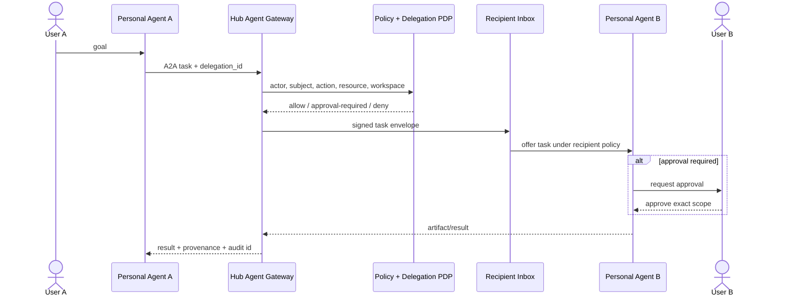
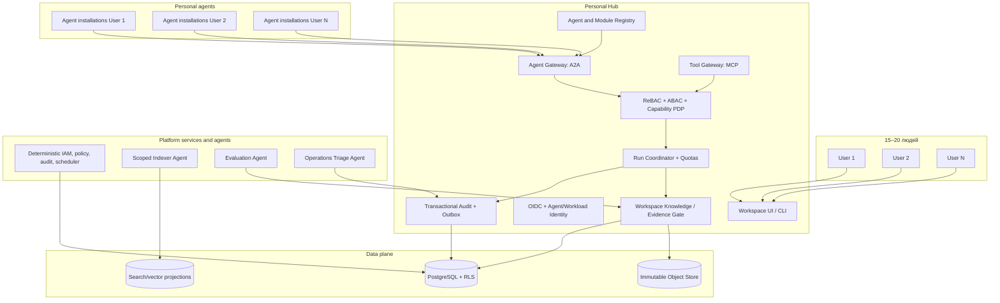

# Личный агентный хаб для 15–20 человек: гипотезы, проверка и уточнённая архитектура

**Дата среза:** 23 августа 2026 года  
**Статус:** расширение исследования `agent_hub_platform_landscape_2026.md`  
**Предмет:** закрытая группа из 15–20 людей; у каждого пользователя есть собственные подключаемые агенты; агенты могут взаимодействовать через платформу; отдельные platform agents обслуживают сам хаб  
**Не является предметом:** реализация прототипа, выбор коммерческого тарифа, фактический performance benchmark

## Аннотация

Уточнение масштаба меняет архитектурный вывод. Для закрытой группы из 15–20 человек не требуется enterprise-платформа с физической федерацией, отдельным event broker и множеством control-plane сервисов. Требуется небольшой личный хаб, который обращается с агентами как с самостоятельными принципалами, но сохраняет человеческое владение, явное делегирование и приватность рабочих пространств.

Проверено 16 фальсифицируемых гипотез. Поддержана конфигурация одного физического hub node с логическим разделением пользователей, workspaces и агентов. Каждый пользователь, определение агента, установленный экземпляр агента и конкретный runtime должны иметь разные идентичности. Агент действует не через скопированные credentials владельца, а через короткоживущую ограниченную delegation grant. Личные агенты не получают общей памяти: они обмениваются типизированными сообщениями и артефактами в явно разрешённых workspaces. Platform agents образуют отдельный класс service principals и не могут автоматически читать личный контент или имитировать пользователя.

Рекомендуемая первая реализация: PostgreSQL с Row-Level Security, объектное хранилище и transactional outbox; A2A для agent-to-agent задач, MCP для tools/resources; relationship-based access model с контекстными capability grants. Физическая федерация и end-to-end encryption являются отдельной веткой, необходимой только если оператор хаба не должен технически иметь доступ к содержимому. Эта privacy-first ветка несовместима с прозрачной серверной индексацией и большинством platform agents без локального исполнения или доверенной вычислительной среды.

## 1. Исследовательская рамка

### 1.1. Основной вопрос

> Какая минимальная архитектура обеспечивает безопасную совместную работу 15–20 людей, принадлежащих им агентов и системных агентов платформы, сохраняя private ownership, управляемое межагентное взаимодействие, аудит и возможность дальнейшего роста?

Подвопросы:

1. Какие identity, ownership и delegation сущности нельзя объединять?
2. Как личный агент одного человека может обратиться к агенту другого, не получая неявный доступ к его данным и полномочиям?
3. Чем platform agent отличается от обычного сервиса и личного агента?
4. Достаточен ли один hub node для верхней оценки в 205 зарегистрированных агентов?
5. Когда privacy-требования вынуждают перейти от централизованного хаба к персональным узлам или E2EE?

### 1.2. Принятая модель доверия

Исследование использует **минимальное взаимное доверие участников**:

- пользователь доверяет собственным агентам только в пределах выданной delegation;
- разные пользователи и их агенты взаимно не доверены по умолчанию;
- shared workspace создаёт ограниченное доверие только к перечисленным ресурсам и действиям;
- platform agents не считаются более истинными или полномочными только из-за системного владельца;
- оператор хаба доверен для инфраструктуры и управления ключами, но его прикладной доступ запрещён политикой, требует break-glass и полностью журналируется;
- root-компрометация центрального узла остаётся способной раскрыть plaintext. Требование криптографической недоступности данных оператору рассматривается отдельной архитектурой B/C.

Последний пункт является границей решения. Если обязательна защита личного содержимого от самого владельца сервера, базовая архитектура A неприемлема.

### 1.3. Метод проверки

Гипотезы проверялись четырьмя способами:

1. **Нормативное соответствие:** A2A, MCP, OAuth, NIST, W3C и PostgreSQL определяют доступные security/interop primitives.
2. **Архитектурное сопоставление:** официальные реализации personal/workspace agents показывают подтверждённые функции и практические опасности, но не используются как независимое доказательство эффективности.
3. **Контрдоказательства:** для каждой положительной гипотезы искался сценарий, где она ломается.
4. **Количественная модель:** рассчитаны principals, потенциальные связи, concurrency, event rate и storage для четырёх сценариев. Это плановая модель, а не измерение.

## 2. Модель участников и владения

### 2.1. Сущности, которые необходимо разделить

| Сущность | Назначение | Владелец | Срок жизни |
|---|---|---|---|
| `HumanUser` | человек, принимающий решения и выдающий полномочия | сам пользователь / группа | долгий |
| `AgentDefinition` | код, модель, prompts, schemas, заявленные capabilities | publisher | versioned, immutable |
| `AgentInstallation` | установленная пользователем конфигурация definition | пользователь или workspace | до удаления/отзыва |
| `AgentRuntimeInstance` | конкретный процесс/контейнер/remote endpoint | installation | один run или lease |
| `DelegationGrant` | право instance действовать от имени пользователя в заданных пределах | пользователь | короткое, отзывное |
| `SharedAgent` | agent installation, принадлежащая workspace | workspace members по governance | versioned |
| `PlatformAgent` | системный агент для поддержки хаба | platform | отдельный service principal |
| `PlatformService` | детерминированный IAM, policy, registry, audit, scheduler | platform | системный |
| `ExternalAgent` | удалённый A2A endpoint, зарегистрированный в хабе | внешний publisher + local sponsor | lease/version |

Разделение `AgentDefinition`, `AgentInstallation` и `AgentRuntimeInstance` предотвращает распространённую ошибку: считать, что доверие к опубликованному шаблону автоматически распространяется на изменённую пользовательскую конфигурацию и каждый её запуск.

### 2.2. Workspaces вместо общей памяти

Минимальные типы пространств:

- `private:user/{id}`: пользователь и явно разрешённые личные агенты;
- `shared:{workspace_id}`: перечисленные люди, shared agents и приглашённые personal agents;
- `platform:operations`: health, costs, queues, module status, security events;
- `group:knowledge`: явно опубликованные и проверенные group artifacts/claims.

Переход между пространствами является операцией `publish/share`, а не побочным эффектом retrieval. Local-first подход связывает collaboration с ownership и portable export ([Ink & Switch, 2019](https://www.inkandswitch.com/essay/local-first/) <!--ref:local-first-2019--><!--anchor:section:Ownership%20and%20collaboration-->), а Solid показывает модель внешне хранимых персональных данных с permissioned application access, хотя текущая спецификация Community Group не является W3C Recommendation ([Solid Protocol 0.11](https://solid.github.io/specification/protocol) <!--ref:solid-0-11--><!--anchor:section:Abstract-->). Эти идеи поддерживают private workspace и exportability, но не требуют вводить Solid Pod в MVP.

### 2.3. Relations и delegation

Пример отношений:

```text
user:daniil owns agent_installation:daniil-researcher
agent_instance:run-123 instance_of agent_installation:daniil-researcher
agent_instance:run-123 acts_for user:daniil via delegation:dlg-789
user:daniil member_of workspace:group-research as editor
agent_installation:daniil-researcher invited_to workspace:group-research as contributor
platform_agent:health-monitor service_of platform with capability:read-operational-metadata
platform_agent:indexer member_of workspace:group-research as content-indexer
```

Zanzibar демонстрирует, что отношения `owner`, `editor`, `viewer` и их композиции дают единообразную модель авторизации для объектов разных приложений ([Pang et al., 2019](https://www.usenix.org/system/files/atc19-pang.pdf) <!--ref:zanzibar-2019--><!--anchor:page:33-36-->). Macaroons показывают attenuated delegation через contextual caveats ([Birgisson et al., 2014](https://research.google/pubs/macaroons-cookies-with-contextual-caveats-for-decentralized-authorization-in-the-cloud/) <!--ref:macaroons-2014--><!--anchor:section:Abstract-->). Для web-совместимого MVP более практичны OAuth Token Exchange, Rich Authorization Requests и proof-of-possession tokens: RFC 8693 различает impersonation и delegation ([RFC 8693](https://www.rfc-editor.org/rfc/rfc8693.html) <!--ref:rfc8693--><!--anchor:section:Abstract-->), RFC 9396 передаёт детализированные authorization details ([RFC 9396](https://www.rfc-editor.org/rfc/rfc9396.html) <!--ref:rfc9396--><!--anchor:section:Introduction-->), а DPoP ограничивает использование украденного bearer token владельцем соответствующего ключа ([RFC 9449](https://www.rfc-editor.org/rfc/rfc9449.html) <!--ref:rfc9449--><!--anchor:section:Introduction-->).

## 3. Реестр проверяемых гипотез

Вердикты: **поддержана** означает, что источники и модель согласуются, а найденные контрпримеры не разрушают утверждение в заданной области; **условно поддержана** содержит явную границу; **отклонена** означает, что исходная формулировка небезопасна или избыточна. Вердикты являются архитектурным синтезом, а не результатом production experiment.

| ID | Гипотеза | Критерий опровержения | Evidence | Counterevidence / граница | Вердикт |
|---|---|---|---|---|---|
| H1 | Один физический hub node достаточен для 15–20 людей | модель требует >1 узла для целевых нагрузок или обязательна admin-blind privacy/offline autonomy | расчёт даёт до 205 agents и 34 events/s при завышенной concurrency | root остаётся общим failure/privacy domain | **условно поддержана** |
| H2 | Закрытой группе всё равно нужна tenant-like изоляция | все участники согласны на полную общую видимость | NIST Zero Trust; PostgreSQL RLS; personal-agent connector risks | слово `tenant` может быть избыточно для UX | **поддержана как workspace isolation** |
| H3 | Human, definition, installation и runtime instance должны иметь разные identity | одна identity обеспечивает однозначную attribution, revocation и versioning | A2A Agent Card; Agent Registry; supply-chain attestations | больше сущностей усложняет UI | **поддержана** |
| H4 | Агенту нельзя передавать долгоживущие credentials владельца | безопасно доказан неизвлекаемый и непереиспользуемый credential | OpenAI предупреждает о personal connections; OAuth delegation/DPoP | token exchange сложнее static secrets | **поддержана** |
| H5 | RBAC недостаточен для personal agents | роли выражают owner/resource/action/context/delegation без role explosion | Zanzibar, Macaroons, RAR | полноценный Zanzibar service избыточен при 20 users | **поддержана; ReBAC + ABAC + capabilities** |
| H6 | Platform agents являются отдельным trust class | system agent может безопасно наследовать admin/user authority | Zero Trust и least privilege против наследования | отдельные principals требуют provisioning | **поддержана** |
| H7 | Межагентные вызовы должны проходить через hub gateway | direct authenticated A2A даёт те же policy, audit, quotas и revocation | A2A security + OWASP insecure inter-agent risk | direct network path полезен для больших artifacts | **условно поддержана для control messages** |
| H8 | Общая writable memory между пользователями/агентами недопустима | poisoning невозможно распространить или каждый read полностью верифицируется | peer-reviewed attacks и OWASP memory poisoning | private short-term memory остаётся полезной | **поддержана** |
| H9 | A2A + MCP покрывают основной interop boundary | требуется семантика, которую оба протокола принципиально не выражают | A2A tasks/artifacts; MCP tools/resources/OAuth | registry, ownership, delegation и knowledge semantics остаются hub-specific | **условно поддержана** |
| H10 | PostgreSQL + RLS + object store + outbox достаточны для MVP | benchmark не выполняет latency/recovery/throughput targets | RLS default-deny и расчёт малой нагрузки | owner/bypass roles обходят RLS; performance ещё не измерен | **условно поддержана** |
| H11 | Event broker и физическая федерация не нужны в MVP | есть обязательные offline nodes или нагрузка превышает single-node envelope | 34 events/s модель; outbox сохраняет atomicity | federation нужна для admin-blind/local sovereignty | **поддержана для baseline** |
| H12 | Admin-blind privacy совместима с обычными server-side platform agents | сервер может индексировать plaintext, не имея ключа/TEE/local execution | Matrix E2EE скрывает content от homeserver | server-side semantic processing требует расшифровки | **отклонена** |
| H13 | Workspace-mediated interaction лучше all-to-all ACL | pairwise модель остаётся обозримой и безопасной при 205 agents | 41 820 возможных directed edges против bounded workspace relations | некоторые direct agent pairs нужны | **поддержана** |
| H14 | IAM, policy, audit и registry не должны быть LLM-агентами | вероятностный компонент обеспечивает deterministic enforcement | standards требуют проверяемые auth decisions; Agent Cards не являются authority | LLM может помогать объяснять policy, но не решать | **поддержана** |
| H15 | Пользователь должен видеть, от чьего имени и с какими правами действует агент | скрытая delegation не увеличивает ошибки/ущерб | connector warning и approval-gate practice | UX становится тяжелее | **поддержана с progressive disclosure** |
| H16 | Знание не должно автоматически распространяться вслед за сообщением агента | межагентное сообщение всегда является надёжным доказательством | PROV-O и Chain-of-Evidence отделяют claim от evidence | строгий gate замедляет бытовые workflows | **поддержана для shared knowledge** |

## 4. Проверка ключевых гипотез

### 4.1. H1, H10 и H11: один узел достаточен, но это ещё нужно измерить

Для рассматриваемой группы главным ограничителем будут не SQL rows или message routing, а внешние LLM/tool calls, их цена, rate limits и latency. В верхнем сценарии зарегистрировано 205 агентов, из которых при предположении 20% одновременной активности работают 41. Даже при 50 internal events в минуту на active run это около 34 events/s. Такой расчёт не доказывает производительность PostgreSQL, но делает microservice/event-broker архитектуру необоснованной до benchmark.

PostgreSQL Row-Level Security может фильтровать `SELECT/INSERT/UPDATE/DELETE` по пользователю и использует default-deny, если RLS включён, но подходящей policy нет ([PostgreSQL 18](https://www.postgresql.org/docs/current/ddl-rowsecurity.html) <!--ref:postgres-rls-18--><!--anchor:section:Row%20Security%20Policies-->). Важное контрдоказательство находится в той же документации: table owner и роли с `BYPASSRLS` обычно обходят политики. Поэтому application role не должна владеть таблицами, migration/admin и runtime credentials разделяются, а тесты обязаны проверять object store, cache и vector projection, а не только SQL.

Физическая федерация станет необходимой не из-за 20 пользователей, а если появится одно из требований: пользователь хранит private data только на своей машине; хаб должен работать при отключённом центральном узле; оператор не должен видеть plaintext; разные пользователи принадлежат независимым trust domains.

### 4.2. H3–H6: identity и делегирование являются ядром продукта

A2A рассматривает агента как обычное network application: Agent Card публикует capabilities и security schemes, credentials получаются out-of-band, а карты могут подписываться ([A2A Protocol, 2026](https://a2a-protocol.org/latest/specification/) <!--ref:a2a-v1--><!--anchor:section:Authentication%20and%20Authorization-->). Google Agent Registry отдельно хранит `Agent`, `Endpoint`, `Skill`, `SkillRevision` и `Publisher`, что подтверждает необходимость различать executable endpoint, capability metadata и publisher ([Google Cloud Agent Registry](https://docs.cloud.google.com/agent-registry/overview) <!--ref:google-agent-registry-2026--><!--anchor:section:Agent%20Registry%20overview-->).

Но Agent Card не доказывает, что конкретный instance сейчас действует от имени пользователя. Для каждого request нужны как минимум:

```text
authenticated_principal = agent_instance_id
subject                = user_id | workspace_id | platform
actor                  = agent_instance_id
delegation_id          = short-lived, revocable grant
action                 = exact operation
resource               = canonical resource id
purpose                = task/run id
constraints            = time, budget, network, data classification
```

OpenAI Workspace Agents дают практическое контрдоказательство упрощённой RBAC-модели: если разрешить публикацию агента с personal connection, другие пользователи могут выполнять действия через credentials создателя; документация рекомендует least privilege, ограничение аудитории и регулярный аудит ([OpenAI Help, 2026](https://help.openai.com/en/articles/20001143) <!--ref:openai-workspace-agent-controls-2026--><!--anchor:section:Role-based%20access%20controls-->). Следовательно, `who may run agent` и `whose connector authority agent uses` являются разными отношениями.

Platform agents не должны иметь `admin` или `act_as:any_user`. Health monitor читает operational metadata; cost agent читает usage; indexer получает content только в workspace, где он явно добавлен; support agent видит redacted diagnostics. Break-glass выполняет человек-оператор, а не LLM.

### 4.3. H7–H9 и H13: взаимодействие через workspaces и gateway

Прямой all-to-all граф при 205 агентах допускает 41 820 направленных пар. Даже если большинство не используется, pairwise ACL становится непроверяемым. Hub должен маршрутизировать interaction через workspace/channel membership и capability grants.



Gateway обязателен для control messages, policy, quotas, attribution и revocation. Большие immutable artifacts могут передаваться на
прямую по short-lived signed URL после отдельной проверки. A2A несёт task/message/artifact lifecycle; MCP соединяет агент с tools/resources и требует OAuth resource indicators и scope minimization ([MCP Authorization 2025-11-25](https://modelcontextprotocol.io/specification/2025-11-25/basic/authorization) <!--ref:mcp-auth-2025--><!--anchor:section:Resource%20Parameter%20Implementation-->). MCP Tasks дополнительно требуют привязки task к authorization context, иначе угадавший task ID может получить состояние или результат ([MCP Tasks](https://modelcontextprotocol.io/specification/2025-11-25/basic/utilities/tasks) <!--ref:mcp-tasks-2025--><!--anchor:section:Task%20Isolation%20and%20Access%20Control-->).

A2A и MCP не определяют local concepts `owner`, `private workspace`, `shared agent`, `platform agent`, `knowledge promotion` и `budget`. Эти сущности остаются контрактом хаба.

### 4.4. H8 и H16: межагентные сообщения не являются общей памятью

Shared writable memory создаёт не только privacy leak, но и propagation channel. ACL 2025 работа показывает, что pragmatic multi-agent systems уязвимы для оптимизированных prompt attacks через коммуникационную топологию ([Shahroz et al., 2025](https://aclanthology.org/2025.acl-long.476/) <!--ref:agents-under-siege-2025--><!--anchor:section:Abstract-->). OWASP Agentic Top 10 выделяет memory/context poisoning и insecure inter-agent communication как отдельные риски ([OWASP, 2026](https://genai.owasp.org/resource/owasp-top-10-for-agentic-applications-for-2026/) <!--ref:owasp-agentic-2026--><!--anchor:section:OWASP%20Top%2010%20for%20Agentic%20Applications%20for%202026-->).

Поэтому нужны четыре разных объекта:

- `Message`: предложение или запрос; untrusted input;
- `Artifact`: immutable output с digest и provenance;
- `MemoryRecord`: private или workspace-scoped derived context с автором, TTL и trust label;
- `KnowledgeAssertion`: claim, прошедший evidence/evaluation gate.

Сообщение другого агента может создать `PROPOSED` memory/claim, но не `TRUSTED`. PROV-O предоставляет базовые Entity/Activity/Agent relations ([W3C PROV-O](https://www.w3.org/TR/prov-o/) <!--ref:w3c-prov-o--><!--anchor:section:Overview%20of%20the%20Ontology-->), а Scientist One показывает исследовательскую реализацию, где каждый claim должен трассироваться к evidence ([Google Research, 2026](https://research.google/pubs/scientist-one-verifiable-autonomous-research-via-chain-of-evidence/) <!--ref:scientist-one-2026--><!--anchor:section:Abstract-->).

### 4.5. H12: admin-blind privacy создаёт отдельную архитектуру

Matrix демонстрирует, что E2EE room content может быть недоступен участвующим homeservers ([Matrix E2EE specification](https://github.com/matrix-org/matrix-spec/blob/main/content/client-server-api/modules/end_to_end_encryption.md) <!--ref:matrix-e2ee--><!--anchor:section:End-to-End%20Encryption-->). Но server-side indexer, global search, evaluator, moderation и knowledge extraction тогда также не видят plaintext.

Есть только четыре выхода:

1. выполнять personal/platform agents на пользовательском устройстве;
2. передавать ключ выбранному agent instance, принимая его как endpoint доверия;
3. использовать confidential computing/TEE и remote attestation;
4. отказаться от серверной обработки encrypted workspace.

Следовательно, обещать одновременно «администратор технически ничего не видит» и «системные агенты автоматически анализируют весь личный контент» нельзя. Для baseline выбран policy-protected central storage. Privacy-first profile остаётся опцией B.

### 4.6. H14: platform services и platform agents нельзя смешивать

`Identity Provider`, `Policy Decision Point`, `Audit Writer`, `Registry`, `Secret Broker`, `Quota Enforcer` и базовый scheduler должны быть детерминированными сервисами. LLM может объяснить решение пользователю, предложить policy или диагностировать сбой, но не является authoritative enforcement point. NIST Zero Trust фокусируется на защите ресурсов, а не доверии к сетевому положению ([NIST SP 800-207](https://csrc.nist.gov/pubs/sp/800/207/final) <!--ref:nist-zero-trust--><!--anchor:section:Abstract-->). Capability systems лучше поддерживают least privilege и избегание confused deputy, чем неограниченные ambient permissions ([Miller, Yee, & Shapiro, 2003](https://srl.cs.jhu.edu/pubs/SRL2003-02.pdf) <!--ref:capability-myths-2003--><!--anchor:page:1-4-->).

Platform agents могут включать:

- `ConciergeAgent`: помогает найти подходящий модуль, без доступа к private content;
- `WorkspaceIndexerAgent`: индексирует только явно подключённый workspace;
- `EvaluationAgent`: предлагает оценку, но не принимает результат;
- `OperationsTriageAgent`: читает redacted telemetry и создаёт incident proposal;
- `KnowledgeCuratorAgent`: предлагает объединение/оспаривание claims в group knowledge.

## 5. Количественная модель

### 5.1. Зарегистрированные и одновременно активные агенты

Предположения модели: 3 или 10 personal agents на человека, 5 platform agents, одновременно активно 20% зарегистрированных агентов, active run создаёт до 50 internal events/min и 2 LLM/tool calls/min.

| Users | Personal agents / user | Platform agents | Agents total | Principals с людьми | Concurrent agents, 20% | All-pairs directed edges | Internal events/s | External calls/min |
|---:|---:|---:|---:|---:|---:|---:|---:|---:|
| 15 | 3 | 5 | 50 | 65 | 10 | 2 450 | 8.3 | 20 |
| 20 | 3 | 5 | 65 | 85 | 13 | 4 160 | 10.8 | 26 |
| 15 | 10 | 5 | 155 | 170 | 31 | 23 870 | 25.8 | 62 |
| 20 | 10 | 5 | 205 | 225 | 41 | 41 820 | 34.2 | 82 |

Вывод модели: identities и authorization relationships растут быстрее, чем throughput. Поэтому главная ранняя задача не горизонтальное масштабирование, а permission model, attribution, quotas и понятный UX.

Это также ограничивает multi-agent fan-out. Matched-budget исследование показывает, что многоагентность помогает декомпозируемым задачам, но может ухудшать последовательные задачи из-за координации и ошибок, поэтому topology должна включаться по benchmark, а не по числу доступных агентов ([Kim et al., 2026](https://arxiv.org/abs/2512.08296) <!--ref:kim-scaling-agents-2026--><!--anchor:section:Abstract-->).

### 5.2. События и хранение

При 20 пользователях, 50 events/run и 10–100 runs на пользователя в день получается:

| Runs / user / day | Events / year | Raw event payload при среднем 1 KB |
|---:|---:|---:|
| 10 | 3.65 млн | 3.6 GB/year |
| 100 | 36.5 млн | 36.5 GB/year |

Это не включает artifacts, embeddings, traces и backups. Artifacts следует хранить content-addressed в object storage, telemetry имеет отдельную retention policy, а authoritative audit хранит минимальный event payload и digest внешнего объекта.

### 5.3. Benchmark envelope вместо обещания производительности

MVP должен быть испытан на более тяжёлом профиле, чем ожидаемый:

- 20 human users;
- 10 personal agents на пользователя;
- 5 platform agents;
- 40 concurrent runs;
- 100 control events/s burst и 20 events/s sustained;
- 10 млн audit/events records;
- p95 authorization decision < 20 ms локально;
- p95 control-plane API < 250 ms без внешнего model/tool latency;
- recovery после process crash < 60 s;
- 0 unauthorized results в 1 000 adversarial cross-workspace checks.

Пока этот benchmark не выполнен, H1/H10 остаются условно поддержанными.

## 6. Три архитектурные конфигурации

### 6.1. A: Central personal hub с логической изоляцией

Один сервер/домашний кластер хранит пользователей, workspaces, messages, artifacts и policy state. Personal agents подключаются локально или удалённо через Agent Gateway. Оператор технически контролирует инфраструктуру; прикладной доступ ограничен policy/audit.

**Сильные стороны:** минимальная операционная сложность; platform agents работают полноценно; единый audit; дешёвый recovery; соответствует реальной нагрузке.  
**Слабые стороны:** общий failure domain; root может прочитать plaintext; offline personal nodes отсутствуют.  
**Подходит:** доверенная закрытая группа, один владелец инфраструктуры, self-hosted или private cloud.

### 6.2. B: Hybrid personal nodes + shared control hub

У каждого человека есть personal agent gateway/data vault. Центральный хаб хранит registry, identity, shared workspace state и federated references. Private data остаётся на личном узле; агент пользователя решает, что публиковать.

**Сильные стороны:** лучшая data sovereignty; компрометация центра не раскрывает всё; offline/private agents естественны.  
**Слабые стороны:** 15–20 узлов нужно обновлять, резервировать и отзывать; сложнее availability, version negotiation, remote policy и support; platform agents видят только опубликованное.  
**Подходит:** участники не доверяют оператору или требуют хранить данные у себя.

### 6.3. C: E2EE room/message fabric

Люди и агенты работают как clients в encrypted rooms. Hub служит directory, relay и metadata policy point; content доступен только room members и их devices/agents.

**Сильные стороны:** сервер не читает содержимое; хорошо определены room membership и federated messaging; сильная коммуникационная приватность.  
**Слабые стороны:** global search, semantic indexing, central evaluation и automated platform agents ограничены; key/device lifecycle сложен; ontology/knowledge layer всё равно нужно построить отдельно.  
**Подходит:** communication-first hub, где E2EE важнее автоматической работы с общим знанием.

### 6.4. Взвешенное сравнение

Шкала 1–5. Веса отражают заданный сценарий, а не универсальную ценность архитектуры.

| Критерий | Вес | A: Central | B: Personal nodes | C: E2EE rooms |
|---|---:|---:|---:|---:|
| Privacy/isolation между пользователями | 25% | 4 | 5 | 5 |
| Простота эксплуатации для 15–20 людей | 20% | 5 | 2 | 3 |
| Agent interoperability | 15% | 4 | 4 | 3 |
| Полноценные platform agents | 15% | 5 | 3 | 1 |
| Data sovereignty | 10% | 2 | 5 | 5 |
| Audit/evidence integration | 10% | 5 | 4 | 2 |
| Путь миграции | 5% | 4 | 4 | 3 |
| **Итог** | 100% | **4.25** | **3.80** | **3.30** |

**Рекомендация:** A как baseline, но с portable export, external agent gateway, content-addressed artifacts и workspace-scoped identifiers, чтобы позже вынести private workspace в B. Если пользователь подтверждает admin-blind privacy как обязательное свойство, рекомендация меняется на B; A следует отклонить.

## 7. Рекомендуемая архитектура A+



### 7.1. Runtime, события и пакеты

Agent runtime не должен проникать в identity/ontology contracts. LangGraph подходит для stateful graph execution ([LangGraph](https://langchain-ai.github.io/langgraph/index.html) <!--ref:langgraph-2026--><!--anchor:section:Core%20benefits-->), Dapr Agents связывает agents с durable workflows и distributed primitives ([Dapr Agents](https://docs.dapr.io/developing-ai/dapr-agents/dapr-agents-introduction/) <!--ref:dapr-agents-2026--><!--anchor:section:Dapr%20Agents-->), а Temporal предоставляет отдельный durable execution substrate ([Temporal](https://docs.temporal.io/) <!--ref:temporal-2026--><!--anchor:section:Temporal%20is%20an%20open%20source%20platform-->). В baseline достаточно одного простого execution backend; перечисленные системы подключаются за adapter только после failure-recovery сравнения.

Transactional outbox может публиковать CloudEvents-compatible envelopes ([CloudEvents 1.0.2](https://github.com/cloudevents/spec) <!--ref:cloudevents-1-0-2--><!--anchor:section:CloudEvents%20Documents-->). NATS JetStream добавляется, если benchmark подтвердит необходимость отдельного durable broker; его базовая модель остаётся at-least-once, а application effects всё равно требуют idempotency ([NATS JetStream](https://github.com/nats-io/nats.docs/blob/master/nats-concepts/jetstream/README.md) <!--ref:nats-jetstream--><!--anchor:section:Exactly%20once%20semantics-->). OpenTelemetry GenAI conventions применяются к diagnostic telemetry, но не заменяют authoritative audit ([OpenTelemetry GenAI](https://github.com/open-telemetry/semantic-conventions-genai) <!--ref:otel-genai-2026--><!--anchor:section:OpenTelemetry%20GenAI%20Semantic%20Conventions-->).

Agent definitions и installations распространяются как content-addressed OCI artifacts ([OCI Image Specification](https://specs.opencontainers.org/image-spec/) <!--ref:oci-image-2025--><!--anchor:section:Overview-->), подписываются Cosign ([Sigstore](https://docs.sigstore.dev/cosign/verifying/verify/) <!--ref:sigstore-cosign--><!--anchor:section:Keyless%20verification%20using%20OpenID%20Connect-->) и сопровождаются SLSA provenance ([SLSA 1.2](https://slsa.dev/spec/v1.2/) <!--ref:slsa-1-2--><!--anchor:section:Understanding%20SLSA-->). W3C Verifiable Credentials 2.0 могут позже подтверждать publisher/organization claims между независимыми узлами, но не заменяют runtime authentication или delegation ([W3C VC 2.0](https://www.w3.org/TR/vc-data-model-2.0/) <!--ref:w3c-vc-2--><!--anchor:section:Introduction-->).

Для knowledge objects SHACL может проверять переносимые RDF/JSON-LD shapes ([W3C SHACL](https://www.w3.org/TR/shacl/) <!--ref:w3c-shacl--><!--anchor:section:Introduction-->). В MVP те же обязательные свойства должны дублироваться SQL constraints и application validators, чтобы graph export не становился единственным enforcement layer.

### 7.2. Проверка доступа

Каждое значимое действие проходит одну функцию решения:

```text
authorize(
  authenticated_agent_instance,
  subject_user_or_workspace,
  delegation_grant,
  exact_action,
  canonical_resource,
  purpose_run,
  risk_context
)
```

Порядок проверки:

1. authenticate конкретный agent instance и sender-constrain его token;
2. проверить definition/installation/version и статус quarantine/revocation;
3. проверить delegation: кто выдал, кому, action/resource, срок, budget;
4. вычислить workspace relationships;
5. применить data classification, risk и purpose attributes;
6. проверить capability, approval и quota;
7. зафиксировать allow/deny и policy version в authoritative audit;
8. выдать short-lived execution credential, а не credentials владельца.

OpenID Shared Signals Framework 1.0 может позже передавать события об отзыве сессии, изменении credentials и risk state между identity components ([OpenID SSF 1.0](https://openid.github.io/sharedsignals/openid-sharedsignals-framework-1_0.html) <!--ref:openid-ssf-2025--><!--anchor:section:Abstract-->). Для одного узла достаточно транзакционного revocation state; стандарт полезен при переходе к external nodes.

### 7.3. Visibility уровни

| Уровень | Люди | Personal agents | Platform agents | Индексация |
|---|---|---|---|---|
| Private | только owner и приглашённые | только installation с grant | нет по умолчанию | отдельная private projection |
| Shared workspace | members по relation | invited agents | только явно добавленные | workspace projection |
| Group knowledge | вся закрытая группа | read; propose по permission | curator/evaluator | group projection |
| Platform operations | оператор и назначенные users | нет | scoped operations agents | metadata only |

## 8. Threat model

| Угроза | Пример | Основной контроль | Проверка |
|---|---|---|---|
| Cross-user data leak | Agent A ищет private memory пользователя B | workspace scope в каждой записи, RLS, scoped object paths/projections | 1 000 adversarial queries по всем data paths |
| Confused deputy | shared agent использует connector автора для другого пользователя | actor/subject split, token exchange, exact delegation | негативные connector tests |
| Agent spoofing/replay | поддельный A2A task от известного агента | TLS, signed Agent Card, DPoP/mTLS, nonce/idempotency | replay suite |
| Memory poisoning | agent публикует инструкцию как shared fact | Message ≠ Memory ≠ Knowledge; provenance; promotion gate | poisoning corpus |
| Insecure inter-agent channel | direct endpoint обходит policy | egress allowlist; gateway-only control plane | network policy test |
| Permission drift | отозванный участник сохраняет token | short TTL, central revocation, Shared Signals позже | revocation latency test |
| Platform-agent overreach | indexer читает все private workspaces | отдельный principal, explicit membership, no wildcard content grant | platform-agent scope tests |
| Cost denial-of-service | agent loop создаёт тысячи model calls | budgets, rate limits, max fan-out/depth, circuit breaker | loop/fan-out tests |
| Supply-chain substitution | новая module version расширяет actions | digest pinning, signature, SBOM/SLSA, re-approval on capability diff | package mutation test |
| Admin/root compromise | operator читает plaintext | audit/break-glass, encryption at rest; profile B для cryptographic protection | restore/key/access drill |
| Metadata privacy | platform видит, кто с кем взаимодействует | minimization, retention, private channel labels | metadata inventory |
| Evaluator collusion | agent и evaluator повторяют одну ошибку | independent checks, heterogeneous evaluators, human gate по риску | disagreement/canary tests |

## 9. MVP и критерии опровержения архитектуры

### 9.1. MVP scope

MVP должен включать:

- 20 test users и четыре workspace types;
- до 10 personal agent installations на пользователя;
- 3–5 platform agents с различными scope;
- agent/module registry;
- A2A gateway и MCP tool gateway;
- delegation grants, approvals, quotas и revocation;
- typed messages, immutable artifacts, scoped memory и group knowledge gate;
- PostgreSQL/RLS, object store, transactional audit/outbox;
- UI, показывающий owner, actor, subject, active permissions, cost и provenance.

### 9.2. Обязательные acceptance checks

1. `user-A/agent-1` не читает private SQL rows, object keys, cache или search/vector hits пользователя B.
2. Запуск shared agent не использует personal connector владельца без отдельной явной delegation.
3. В каждом agent-to-agent event сохранены `actor_agent_instance`, `subject`, `delegation_id`, `workspace`, `run_id`, `policy_version` и audit id.
4. Отзыв grant блокирует новый action не позднее 5 секунд; уже начатый long action переводится в cancel/reconcile по contract.
5. Platform health agent видит состояние run, но не prompt/content.
6. Workspace indexer получает content только после membership grant и теряет доступ после revocation.
7. Message от peer agent не становится shared memory/knowledge без отдельной promotion operation.
8. Crash между state transition и event publication не теряет событие и не создаёт повторный необратимый effect.
9. 40 concurrent runs и заданный benchmark envelope проходят без потери audit events.
10. Пользователь экспортирует definitions, configuration, private artifacts, claims и provenance в переносимом формате.
11. Удаление пользователя формирует проверяемый deletion plan для canonical data, projections, artifacts, secrets и backups.
12. UI различает личного, shared и platform agent и показывает, от чьего имени выполняется high-impact action.

### 9.3. Условия перехода к архитектуре B

Baseline A считается опровергнутым, если выполняется хотя бы одно условие:

- оператор хаба не должен технически иметь возможность читать private content;
- участник обязан хранить исходные данные только на своей машине;
- agents должны работать при длительном отключении central hub;
- разные пользователи управляют независимыми legal/security domains;
- компрометация central node не должна раскрывать group content;
- external participants подключаются без доверия к локальному identity provider.

## 10. Решение и уточнённая оценка

### 10.1. Что изменилось после уточнения

Первоначальная enterprise/federated формулировка была шире необходимого. Для 15–20 людей:

- `tenant` лучше представить пользователю как private/shared workspace, сохранив строгий scope в data model;
- физическая федерация переносится из MVP в privacy/local-sovereignty profile;
- главный архитектурный объект меняется с «организации и узлы» на `human → owned agent installation → delegated runtime instance → workspace`;
- platform agents становятся отдельными участниками, а не невидимой внутренней магией;
- identity, delegation и memory isolation важнее distributed scale.

### 10.2. Финальный verdict

Концепт стал реалистичнее. **Рекомендуется строить Central Personal Hub A+**, если закрытая группа доверяет оператору инфраструктуры на техническом уровне. Дизайн должен быть migration-ready к personal nodes, но не оплачивать их сложность заранее.

Самая важная продуктовая формула:

> У каждого человека есть собственные агенты и приватное пространство. Агент может обратиться к другому человеку или агенту только через видимую, ограниченную и отзывную делегацию. Системные агенты платформы являются такими же ограниченными принципалами и не наследуют власть администратора.

Оценка после уточнения:

| Свойство | Оценка |
|---|---:|
| Соответствие реальному масштабу | 19/20 |
| Реализуемость baseline MVP | 18/20 |
| Ясность дифференциации | 17/20 |
| Privacy при доверенном операторе | 17/20 |
| Privacy от оператора в baseline | 5/20 |
| Контролируемость personal/platform agents | 18/20 при реализации delegation model |
| Общая оценка | **8.5/10** |

## 11. Ограничения и AI disclosure

Отчёт создан с использованием AI-assisted поиска, отбора, синтеза, расчётов и написания. Проверялись доступные первичные исследования, официальные спецификации и vendor documentation; человеческая построчная проверка и локальный архив оригиналов не выполнялись. Заявления производителей подтверждают функции, но не их comparative effectiveness. Количественная модель основана на явно указанных assumptions и не является performance measurement. Гипотезы H1 и H10 нельзя считать окончательно подтверждёнными до нагрузочного и recovery benchmark.

Исследование не включает human-subject data и не требует IRB. Dual-use риск умеренный: те же delegation и inter-agent механизмы могут управлять опасными tools, поэтому high-impact domains требуют отдельных risk profiles, human authority и deny-by-default.

## 12. Источники

### Дополнительно проверенные для personal/multi-user hub

1. Birgisson, A., et al. (2014). [Macaroons: Cookies with contextual caveats for decentralized authorization](https://research.google/pubs/macaroons-cookies-with-contextual-caveats-for-decentralized-authorization-in-the-cloud/)
2. Fett, D., et al. (2023). [RFC 9449: OAuth 2.0 Demonstrating Proof of Possession](https://www.rfc-editor.org/rfc/rfc9449.html)
3. Ink & Switch. (2019). [Local-first software](https://www.inkandswitch.com/essay/local-first/)
4. IETF. (2020). [RFC 8693: OAuth 2.0 Token Exchange](https://www.rfc-editor.org/rfc/rfc8693.html)
5. IETF. (2023). [RFC 9396: OAuth 2.0 Rich Authorization Requests](https://www.rfc-editor.org/rfc/rfc9396.html)
6. Matrix.org Foundation. (2026). [Matrix protocol specification](https://spec.matrix.org/latest/)
7. Miller, M. S., Yee, K.-P., & Shapiro, J. (2003). [Capability myths demolished](https://srl.cs.jhu.edu/pubs/SRL2003-02.pdf)
8. NIST. (2020). [SP 800-207: Zero Trust Architecture](https://csrc.nist.gov/pubs/sp/800/207/final)
9. OpenAI. (2026). [Workspace agents security and admin controls](https://help.openai.com/en/articles/20001143)
10. OpenID Foundation. (2025). [Shared Signals Framework 1.0](https://openid.github.io/sharedsignals/openid-sharedsignals-framework-1_0.html)
11. Pang, R., et al. (2019). [Zanzibar: Google’s consistent, global authorization system](https://www.usenix.org/system/files/atc19-pang.pdf)
12. PostgreSQL Global Development Group. (2026). [Row Security Policies](https://www.postgresql.org/docs/current/ddl-rowsecurity.html)
13. Solid Community Group. (2024). [Solid Protocol 0.11](https://solid.github.io/specification/protocol)
14. W3C. (2025). [Verifiable Credentials Data Model 2.0](https://www.w3.org/TR/vc-data-model-2.0/)
15. Google Cloud. (2026). [Agent Registry overview](https://docs.cloud.google.com/agent-registry/overview)

### Повторно использованные стандарты и исследования базового отчёта

16. A2A Project. (2026). [A2A Protocol Specification v1.0](https://a2a-protocol.org/latest/specification/)
17. Cloud Native Computing Foundation. (2022). [CloudEvents Specification v1.0.2](https://github.com/cloudevents/spec)
18. Dapr. (2026). [Dapr Agents introduction](https://docs.dapr.io/developing-ai/dapr-agents/dapr-agents-introduction/)
19. Google Research. (2026). [Scientist One: Chain-of-Evidence](https://research.google/pubs/scientist-one-verifiable-autonomous-research-via-chain-of-evidence/)
20. Kim, Y., et al. (2026). [Towards a science of scaling agent systems](https://arxiv.org/abs/2512.08296)
21. LangChain. (2026). [LangGraph documentation](https://langchain-ai.github.io/langgraph/index.html)
22. Model Context Protocol. (2025). [Authorization specification](https://modelcontextprotocol.io/specification/2025-11-25/basic/authorization)
23. Model Context Protocol. (2025). [Tasks specification](https://modelcontextprotocol.io/specification/2025-11-25/basic/utilities/tasks)
24. NATS. (2026). [JetStream concepts](https://github.com/nats-io/nats.docs/blob/master/nats-concepts/jetstream/README.md)
25. Open Container Initiative. (2025). [OCI Image Specification](https://specs.opencontainers.org/image-spec/)
26. OpenTelemetry. (2026). [GenAI Semantic Conventions](https://github.com/open-telemetry/semantic-conventions-genai)
27. OWASP. (2026). [Top 10 for Agentic Applications](https://genai.owasp.org/resource/owasp-top-10-for-agentic-applications-for-2026/)
28. Shahroz, M., et al. (2025). [Agents under siege](https://aclanthology.org/2025.acl-long.476/)
29. Sigstore. (2026). [Cosign signature verification](https://docs.sigstore.dev/cosign/verifying/verify/)
30. SLSA. (2026). [SLSA Specification v1.2](https://slsa.dev/spec/v1.2/)
31. Temporal. (2026). [Temporal documentation](https://docs.temporal.io/)
32. W3C. (2013). [PROV-O](https://www.w3.org/TR/prov-o/)
33. W3C. (2017). [SHACL](https://www.w3.org/TR/shacl/)
